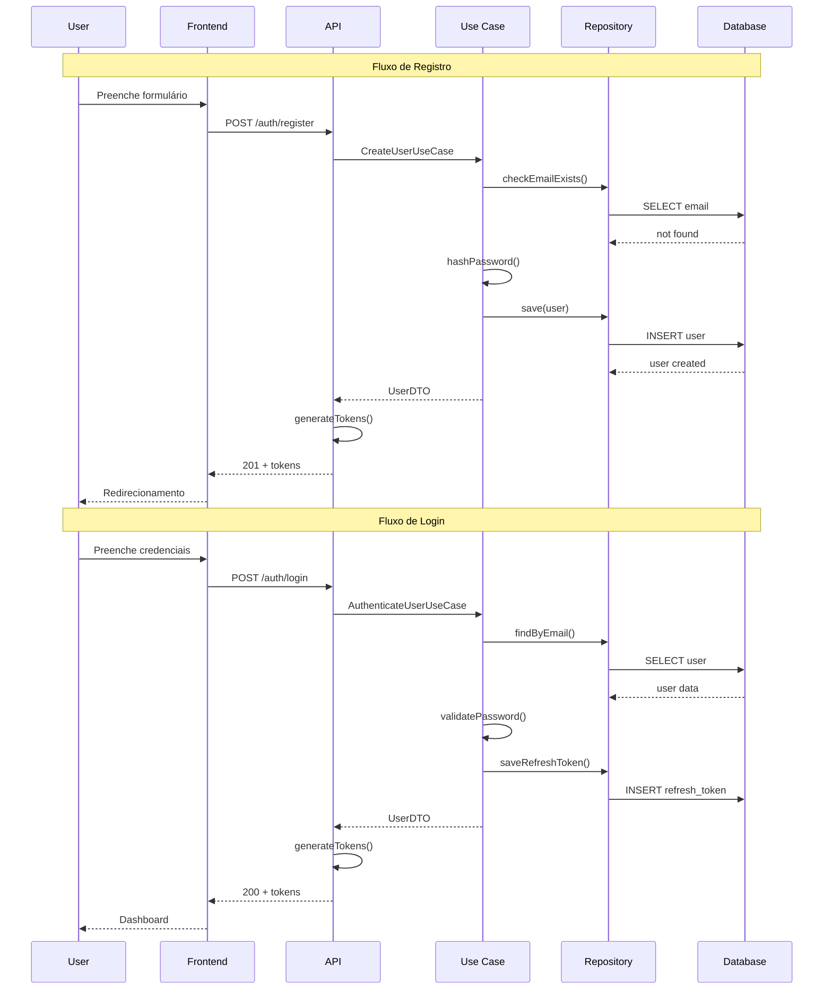

# Módulo de Autenticação - Requisitos Funcionais

## Metadata
- **Módulo**: Autenticação e Autorização
- **Versão**: 1.0
- **Última Atualização**: 2026-02-08
- **Status**: Draft
- **Prioridade Geral**: 🔴 Must Have (MVP)

## Visão Geral

O módulo de autenticação é responsável por gerenciar o acesso seguro ao sistema, incluindo registro de novos usuários, login, gerenciamento de sessões via JWT (JSON Web Tokens) e recuperação de senha. Este é o módulo base que habilita todos os outros módulos do sistema.

A segurança é prioridade máxima: senhas são hasheadas com bcrypt (cost 10), tokens JWT têm curta duração (15 minutos) com refresh tokens de 7 dias, e todas as operações sensíveis requerem autenticação válida.

## Personas

### Persona 1: João - Novo Usuário
- **Idade**: 28 anos
- **Objetivo**: Começar a treinar
- **Necessidade**: Criar conta rapidamente e de forma segura

### Persona 2: Maria - Usuária Recorrente
- **Idade**: 35 anos
- **Objetivo**: Manter acesso ao histórico de treinos
- **Necessidade**: Login rápido e manter sessão ativa

## Casos de Uso Principais

1. **UC-AUTH-001**: Registrar nova conta
2. **UC-AUTH-002**: Fazer login no sistema
3. **UC-AUTH-003**: Renovar token expirado
4. **UC-AUTH-004**: Fazer logout
5. **UC-AUTH-005**: Recuperar senha esquecida

---

## Requisitos Funcionais

### RF-AUTH-001: Registro de Novo Usuário

**Prioridade**: 🔴 Must Have  
**Status**: Pending

**Descrição**:
O sistema deve permitir que novos usuários criem uma conta fornecendo nome completo, email válido e senha segura. O email deve ser único no sistema.

**Critérios de Aceitação**:
- [ ] Usuário fornece nome, email e senha
- [ ] Email é validado (formato correto)
- [ ] Senha atende requisitos mínimos de segurança
- [ ] Email não pode já estar cadastrado
- [ ] Senha é hasheada antes de salvar no banco
- [ ] Retorna token JWT após registro bem-sucedido
- [ ] Retorna erro claro em caso de falha

**Regras de Negócio**:
- **RN-AUTH-001**: Email deve ser único no sistema
- **RN-AUTH-002**: Senha deve ter mínimo 8 caracteres
- **RN-AUTH-003**: Senha deve conter letras e números
- **RN-AUTH-004**: Nome deve ter entre 2 e 100 caracteres
- **RN-AUTH-005**: Email deve ter formato válido (regex)

**Dependências**:
- Nenhuma (primeiro requisito a ser implementado)

**Entidades do Domínio**:
- `User` (id, email, password, name, createdAt, updatedAt)
- `Email` (Value Object)
- `Password` (Value Object)

**Use Cases da Aplicação**:
- `CreateUserUseCase`

**Repositórios**:
- `IUserRepository` (interface)
- `PrismaUserRepository` (implementação)

**API Endpoints**:
```http
POST /api/v1/auth/register
Content-Type: application/json

Request:
{
  "name": "João Silva",
  "email": "joao@example.com",
  "password": "Senha123"
}

Response (201 Created):
{
  "user": {
    "id": "uuid",
    "name": "João Silva",
    "email": "joao@example.com",
    "createdAt": "2026-02-08T00:00:00Z"
  },
  "accessToken": "eyJhbGc...",
  "refreshToken": "eyJhbGc..."
}
```

**Validações**:
- `name`: obrigatório, string, 2-100 caracteres
- `email`: obrigatório, formato válido, único
- `password`: obrigatório, mínimo 8 caracteres, letras + números

**Mensagens de Erro**:
- **E-AUTH-001**: "Email already exists"
- **E-AUTH-002**: "Invalid email format"
- **E-AUTH-003**: "Password must be at least 8 characters"
- **E-AUTH-004**: "Password must contain letters and numbers"
- **E-AUTH-005**: "Name is required"

**Testes Necessários**:
- **Unit**: `Email` value object valida formato
- **Unit**: `Password` value object valida requisitos
- **Unit**: `CreateUserUseCase` cria usuário corretamente
- **Integration**: Repository salva usuário no banco
- **Integration**: Endpoint retorna 201 com token
- **E2E**: Fluxo completo de registro via API

---

### RF-AUTH-002: Login com Email e Senha

**Prioridade**: 🔴 Must Have  
**Status**: Pending

**Descrição**:
Usuários registrados devem poder fazer login fornecendo email e senha. O sistema valida as credenciais e retorna tokens JWT (access + refresh) para manter sessão.

**Critérios de Aceitação**:
- [ ] Usuário fornece email e senha
- [ ] Sistema valida se email existe
- [ ] Sistema valida se senha está correta
- [ ] Retorna access token (15 min) e refresh token (7 dias)
- [ ] Refresh token é salvo no banco
- [ ] Retorna erro 401 se credenciais inválidas
- [ ] Registra tentativa de login

**Regras de Negócio**:
- **RN-AUTH-006**: Access token expira em 15 minutos
- **RN-AUTH-007**: Refresh token expira em 7 dias
- **RN-AUTH-008**: Bloquear conta após 5 tentativas falhas (futuro)

**Dependências**:
- RF-AUTH-001: Usuário deve estar registrado

**Entidades do Domínio**:
- `User`
- `RefreshToken`
- `Email` (Value Object)

**Use Cases da Aplicação**:
- `AuthenticateUserUseCase`

**Serviços**:
- `IAuthService` (interface)
- `JWTAuthService` (implementação)

**API Endpoints**:
```http
POST /api/v1/auth/login
Content-Type: application/json

Request:
{
  "email": "joao@example.com",
  "password": "Senha123"
}

Response (200 OK):
{
  "user": {
    "id": "uuid",
    "name": "João Silva",
    "email": "joao@example.com"
  },
  "accessToken": "eyJhbGc...",
  "refreshToken": "eyJhbGc..."
}

Response (401 Unauthorized):
{
  "error": "Invalid credentials",
  "code": "E-AUTH-101"
}
```

**Validações**:
- `email`: obrigatório, formato válido
- `password`: obrigatório

**Mensagens de Erro**:
- **E-AUTH-101**: "Invalid credentials"
- **E-AUTH-102**: "Email is required"
- **E-AUTH-103**: "Password is required"

**Testes Necessários**:
- **Unit**: `AuthenticateUserUseCase` valida credenciais
- **Unit**: JWT service gera tokens válidos
- **Integration**: Login bem-sucedido retorna tokens
- **Integration**: Login com senha errada retorna 401
- **E2E**: Fluxo de login + acesso a endpoint protegido

---

### RF-AUTH-003: Logout

**Prioridade**: 🔴 Must Have  
**Status**: Pending

**Descrição**:
Usuários autenticados devem poder fazer logout, invalidando o refresh token atual e encerrando a sessão.

**Critérios de Aceitação**:
- [ ] Usuário autenticado pode fazer logout
- [ ] Refresh token é removido do banco
- [ ] Access token continua válido até expirar (sem blacklist)
- [ ] Frontend deve descartar tokens localmente

**Regras de Negócio**:
- **RN-AUTH-009**: Apenas refresh token é invalidado no servidor
- **RN-AUTH-010**: Access tokens expiram naturalmente (stateless)

**Dependências**:
- RF-AUTH-002: Usuário deve estar logado

**Entidades do Domínio**:
- `RefreshToken`

**Use Cases da Aplicação**:
- `LogoutUserUseCase`

**API Endpoints**:
```http
POST /api/v1/auth/logout
Authorization: Bearer {accessToken}

Response (204 No Content)
```

**Testes Necessários**:
- **Integration**: Logout remove refresh token do banco
- **E2E**: Após logout, refresh token não funciona mais

---

### RF-AUTH-004: Refresh de Token JWT

**Prioridade**: 🔴 Must Have  
**Status**: Pending

**Descrição**:
Quando o access token expira (15 min), o frontend deve poder obter novo access token usando o refresh token, sem exigir novo login.

**Critérios de Aceitação**:
- [ ] Cliente envia refresh token válido
- [ ] Sistema valida se refresh token existe e não expirou
- [ ] Retorna novo access token
- [ ] Refresh token permanece o mesmo (não rotaciona)
- [ ] Retorna erro 401 se refresh token inválido/expirado

**Regras de Negócio**:
- **RN-AUTH-011**: Refresh token não rotaciona (reutilizável)
- **RN-AUTH-012**: Refresh token expira após 7 dias
- **RN-AUTH-013**: Cada login cria novo refresh token

**Dependências**:
- RF-AUTH-002: Refresh token foi criado no login

**Entidades do Domínio**:
- `RefreshToken`
- `User`

**Use Cases da Aplicação**:
- `RefreshAccessTokenUseCase`

**API Endpoints**:
```http
POST /api/v1/auth/refresh
Content-Type: application/json

Request:
{
  "refreshToken": "eyJhbGc..."
}

Response (200 OK):
{
  "accessToken": "eyJhbGc...",
  "expiresIn": 900
}

Response (401 Unauthorized):
{
  "error": "Invalid or expired refresh token",
  "code": "E-AUTH-201"
}
```

**Mensagens de Erro**:
- **E-AUTH-201**: "Invalid or expired refresh token"
- **E-AUTH-202**: "Refresh token is required"

**Testes Necessários**:
- **Unit**: `RefreshAccessTokenUseCase` gera novo token
- **Integration**: Refresh com token válido funciona
- **Integration**: Refresh com token expirado retorna 401
- **E2E**: Access token expirado + refresh + nova requisição

---

### RF-AUTH-005: Recuperação de Senha

**Prioridade**: 🟡 Should Have  
**Status**: Pending

**Descrição**:
Usuários que esqueceram a senha devem poder solicitar reset via email, receber link temporário e definir nova senha.

**Critérios de Aceitação**:
- [ ] Usuário solicita reset fornecendo email
- [ ] Sistema gera token temporário (1 hora)
- [ ] Email é enviado com link de reset
- [ ] Link leva a página de nova senha
- [ ] Nova senha é validada e atualizada
- [ ] Token é invalidado após uso

**Regras de Negócio**:
- **RN-AUTH-014**: Token de reset expira em 1 hora
- **RN-AUTH-015**: Token só pode ser usado uma vez
- **RN-AUTH-016**: Nova senha deve ser diferente da antiga

**Dependências**:
- RF-AUTH-001: Usuário deve existir no sistema
- Serviço de email (SMTP)

**Entidades do Domínio**:
- `User`
- `PasswordResetToken` (nova entidade necessária)

**Use Cases da Aplicação**:
- `RequestPasswordResetUseCase`
- `ResetPasswordUseCase`

**API Endpoints**:
```http
POST /api/v1/auth/forgot-password
Content-Type: application/json

Request:
{
  "email": "joao@example.com"
}

Response (200 OK):
{
  "message": "Password reset email sent"
}

---

POST /api/v1/auth/reset-password
Content-Type: application/json

Request:
{
  "token": "reset-token-uuid",
  "newPassword": "NovaSenha123"
}

Response (200 OK):
{
  "message": "Password reset successfully"
}
```

**Validações**:
- Nova senha deve atender requisitos de segurança
- Token deve ser válido e não expirado

**Mensagens de Erro**:
- **E-AUTH-301**: "Email not found"
- **E-AUTH-302**: "Invalid or expired reset token"
- **E-AUTH-303**: "New password cannot be the same as old password"

**Testes Necessários**:
- **Unit**: Geração de token de reset
- **Integration**: Email é enviado com token
- **Integration**: Reset com token válido funciona
- **E2E**: Fluxo completo de recuperação de senha

---

### RF-AUTH-006: Validação de Email Único

**Prioridade**: 🔴 Must Have  
**Status**: Pending

**Descrição**:
O sistema deve garantir que cada email seja único no banco de dados, impedindo duplicatas e fornecendo feedback claro ao usuário durante o registro.

**Critérios de Aceitação**:
- [ ] Constraint UNIQUE no campo email do banco
- [ ] Validação no domínio antes de salvar
- [ ] Endpoint para verificar disponibilidade de email
- [ ] Mensagem clara se email já existe

**Regras de Negócio**:
- **RN-AUTH-017**: Emails case-insensitive (lowercase no banco)
- **RN-AUTH-018**: Espaços no email são removidos (trim)

**Dependências**:
- RF-AUTH-001: Parte do fluxo de registro

**Entidades do Domínio**:
- `User`
- `Email` (Value Object)

**Use Cases da Aplicação**:
- `CheckEmailAvailabilityUseCase` (opcional, para UX)

**API Endpoints**:
```http
GET /api/v1/auth/check-email?email=joao@example.com

Response (200 OK):
{
  "available": true
}

Response (200 OK):
{
  "available": false,
  "message": "Email already registered"
}
```

**Validações**:
- Email deve ser lowercase
- Email deve ser trimmed
- Formato válido (regex)

**Mensagens de Erro**:
- **E-AUTH-001**: "Email already exists" (já definido)

**Testes Necessários**:
- **Unit**: Email value object valida formato
- **Unit**: Email é convertido para lowercase
- **Integration**: Constraint UNIQUE funciona no banco
- **E2E**: Tentar registrar email duplicado retorna erro

---

## Diagrama de Fluxo: Registro e Login



## Implementação DDD

### Domain Layer

**Arquivo**: `apps/api/src/domain/entities/user.ts`
```typescript
export class User {
  constructor(
    public readonly id: UniqueEntityID,
    public readonly email: Email,
    private password: Password,
    public name: string,
    public readonly createdAt: Date,
    public updatedAt: Date
  ) {}
}
```

**Arquivo**: `apps/api/src/domain/value-objects/email.ts`
```typescript
export class Email {
  private constructor(public readonly value: string) {}
  
  static create(email: string): Result<Email> {
    // Validação de formato
  }
}
```

**Arquivo**: `apps/api/src/domain/value-objects/password.ts`
```typescript
export class Password {
  private constructor(
    public readonly value: string,
    public readonly hashed: boolean
  ) {}
  
  static create(password: string): Result<Password> {
    // Validação de requisitos
  }
  
  async hash(): Promise<string> {
    // Bcrypt hash
  }
}
```

**Arquivo**: `apps/api/src/domain/repositories/user-repository.interface.ts`
```typescript
export interface IUserRepository {
  save(user: User): Promise<void>;
  findByEmail(email: Email): Promise<User | null>;
  findById(id: string): Promise<User | null>;
  emailExists(email: Email): Promise<boolean>;
}
```

### Application Layer

**Arquivo**: `apps/api/src/application/use-cases/create-user.use-case.ts`
```typescript
@injectable()
export class CreateUserUseCase {
  constructor(
    @inject(TYPES.UserRepository) 
    private userRepository: IUserRepository
  ) {}
  
  async execute(dto: CreateUserDTO): Promise<UserDTO> {
    // 1. Validar email único
    // 2. Criar entidade User
    // 3. Hash password
    // 4. Salvar no repositório
    // 5. Retornar DTO
  }
}
```

**Arquivo**: `apps/api/src/application/dtos/auth.dto.ts`
```typescript
export interface CreateUserDTO {
  name: string;
  email: string;
  password: string;
}

export interface UserDTO {
  id: string;
  name: string;
  email: string;
  createdAt: Date;
}

export interface LoginDTO {
  email: string;
  password: string;
}

export interface AuthResponseDTO {
  user: UserDTO;
  accessToken: string;
  refreshToken: string;
}
```

### Infrastructure Layer

**Arquivo**: `apps/api/src/infrastructure/database/repositories/prisma-user-repository.ts`
```typescript
@injectable()
export class PrismaUserRepository implements IUserRepository {
  constructor(
    @inject(TYPES.PrismaClient) 
    private prisma: PrismaClient
  ) {}
  
  async save(user: User): Promise<void> {
    // Prisma create
  }
  
  async findByEmail(email: Email): Promise<User | null> {
    // Prisma findUnique
  }
}
```

**Arquivo**: `apps/api/src/infrastructure/http/controllers/auth-controller.ts`
```typescript
export class AuthController {
  constructor(
    private createUserUseCase: CreateUserUseCase,
    private authenticateUserUseCase: AuthenticateUserUseCase
  ) {}
  
  async register(request: FastifyRequest, reply: FastifyReply) {
    // Validar input com Zod
    // Executar use case
    // Gerar tokens
    // Retornar response
  }
  
  async login(request: FastifyRequest, reply: FastifyReply) {
    // Validar input
    // Executar use case
    // Gerar tokens
    // Retornar response
  }
}
```

**Arquivo**: `apps/api/src/infrastructure/http/routes/auth-routes.ts`
```typescript
export async function authRoutes(app: FastifyInstance) {
  app.post('/auth/register', authController.register);
  app.post('/auth/login', authController.login);
  app.post('/auth/logout', { preHandler: [authenticate] }, authController.logout);
  app.post('/auth/refresh', authController.refresh);
  app.get('/auth/check-email', authController.checkEmail);
}
```

## Segurança

### Hashing de Senhas
- Algoritmo: bcrypt
- Cost factor: 10
- Salt: gerado automaticamente

### JWT Configuration
- Algorithm: HS256
- Access token: 15 minutos
- Refresh token: 7 dias
- Secret: variável de ambiente (JWT_SECRET)

### Rate Limiting
- Registro: 5 tentativas por IP/hora
- Login: 10 tentativas por IP/hora
- Reset senha: 3 tentativas por email/hora

## Priorização Final

| RF | Título | Prioridade | Ordem de Implementação |
|----|--------|------------|------------------------|
| RF-AUTH-001 | Registro | Must Have | 1º |
| RF-AUTH-002 | Login | Must Have | 2º |
| RF-AUTH-004 | Refresh Token | Must Have | 3º |
| RF-AUTH-003 | Logout | Must Have | 4º |
| RF-AUTH-006 | Email Único | Must Have | 5º (junto com RF-AUTH-001) |
| RF-AUTH-005 | Recuperação Senha | Should Have | 6º (após MVP) |

## Checklist de Implementação

- [ ] Domain: Entities (User)
- [ ] Domain: Value Objects (Email, Password)
- [ ] Domain: Repository Interface (IUserRepository)
- [ ] Application: DTOs (CreateUserDTO, LoginDTO, etc)
- [ ] Application: Use Cases (Create, Authenticate, Refresh, Logout)
- [ ] Infrastructure: Prisma Repository
- [ ] Infrastructure: JWT Service
- [ ] Infrastructure: Auth Controller
- [ ] Infrastructure: Auth Routes
- [ ] Infrastructure: Auth Middleware
- [ ] Tests: Unit tests para domain e use cases
- [ ] Tests: Integration tests para repositories e API
- [ ] Tests: E2E tests para fluxos completos
