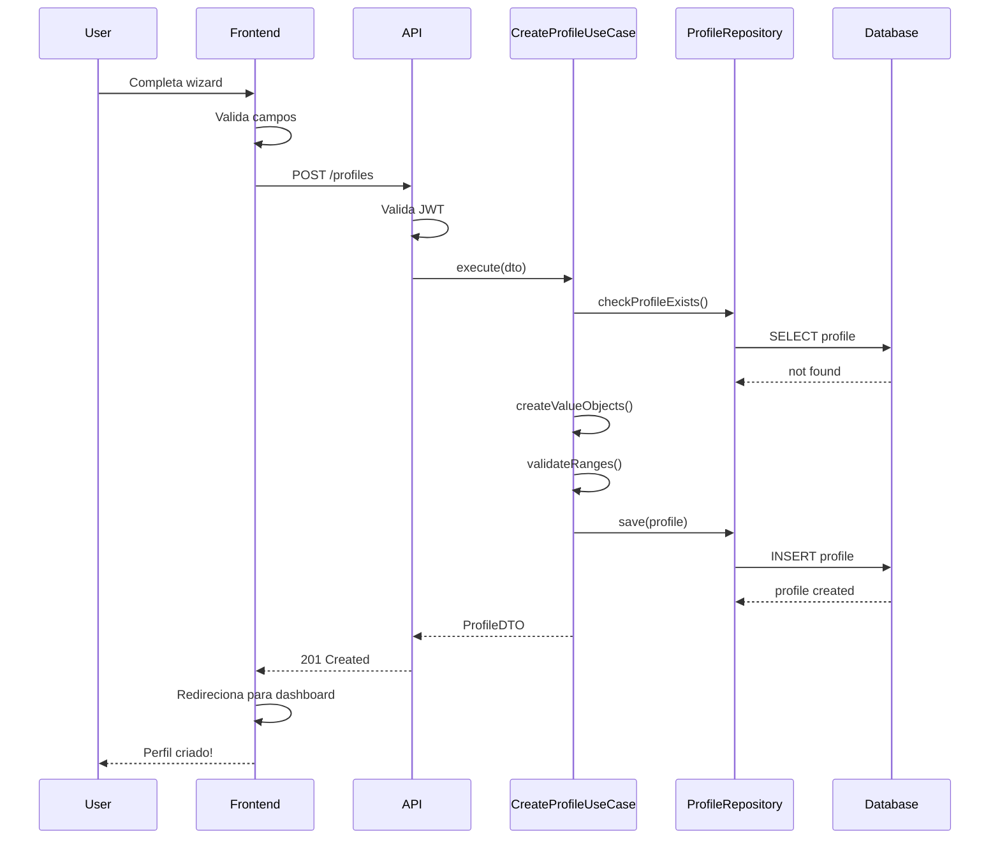

# Módulo de Perfil - Requisitos Funcionais

## Metadata
- **Módulo**: Perfil do Usuário
- **Versão**: 1.0
- **Última Atualização**: 2026-02-08
- **Status**: Draft
- **Prioridade Geral**: 🔴 Must Have (MVP)

## Visão Geral

O módulo de perfil gerencia as informações pessoais e preferências do usuário, que são fundamentais para a geração personalizada de planos de treino e nutrição pela IA. O perfil inclui dados antropométricos (idade, peso, altura), objetivos fitness, nível de experiência, preferências de treino e restrições alimentares.

Um perfil completo e preciso resulta em planos mais eficazes e personalizados. O sistema deve facilitar a atualização constante dos dados, especialmente peso e medidas, para ajustar recomendações conforme o progresso.

## Personas

### Persona 1: Ana - Iniciante
- **Idade**: 25 anos, sedentária
- **Objetivo**: Perder peso e ganhar condicionamento
- **Equipamento**: Sem equipamentos (treino em casa)
- **Restrições**: Alergia a lactose

### Persona 2: Carlos - Intermediário
- **Idade**: 32 anos, pratica há 2 anos
- **Objetivo**: Ganhar massa muscular
- **Equipamento**: Academia completa
- **Restrições**: Lesão no joelho direito

## Casos de Uso Principais

1. **UC-PROFILE-001**: Criar perfil inicial após registro
2. **UC-PROFILE-002**: Atualizar dados pessoais
3. **UC-PROFILE-003**: Configurar preferências de treino
4. **UC-PROFILE-004**: Configurar preferências alimentares
5. **UC-PROFILE-005**: Visualizar perfil completo

---

## Requisitos Funcionais

### RF-PROFILE-001: Criar Perfil Inicial

**Prioridade**: 🔴 Must Have  
**Status**: Pending

**Descrição**:
Após o registro, o usuário deve criar um perfil fornecendo dados essenciais: idade, gênero, peso, altura, objetivo fitness, nível de experiência e equipamentos disponíveis. Estes dados são obrigatórios para gerar planos personalizados.

**Critérios de Aceitação**:
- [ ] Usuário autenticado pode criar perfil
- [ ] Cada usuário tem apenas um perfil (relação 1:1)
- [ ] Dados antropométricos são validados
- [ ] Objetivo e nível são selecionados via enum
- [ ] Equipamentos disponíveis são multi-seleção
- [ ] Perfil é associado ao usuário via userId
- [ ] Frontend redireciona para wizard de criação de perfil

**Regras de Negócio**:
- **RN-PROFILE-001**: Idade mínima 16 anos, máxima 100 anos
- **RN-PROFILE-002**: Peso entre 30kg e 300kg
- **RN-PROFILE-003**: Altura entre 100cm e 250cm
- **RN-PROFILE-004**: Perfil é criado automaticamente ao completar wizard
- **RN-PROFILE-005**: Usuário sem perfil não pode gerar planos

**Dependências**:
- RF-AUTH-001: Usuário deve estar registrado
- RF-AUTH-002: Usuário deve estar autenticado

**Entidades do Domínio**:
- `UserProfile` (id, userId, age, gender, height, weight, goal, level, equipment, availableDays, availableTime, restrictions, dietaryRestrictions, mealsPerDay)
- `Weight` (Value Object)
- `Height` (Value Object)
- `Age` (Value Object)

**Use Cases da Aplicação**:
- `CreateUserProfileUseCase`

**API Endpoints**:
```http
POST /api/v1/profiles
Authorization: Bearer {accessToken}
Content-Type: application/json

Request:
{
  "age": 28,
  "gender": "MALE",
  "height": 175.0,
  "weight": 80.5,
  "goal": "GAIN_MUSCLE",
  "level": "INTERMEDIATE",
  "equipment": ["FULL_GYM"],
  "availableDays": ["monday", "wednesday", "friday"],
  "availableTime": 60,
  "restrictions": [],
  "dietaryRestrictions": [],
  "mealsPerDay": 4
}

Response (201 Created):
{
  "id": "uuid",
  "userId": "uuid",
  "age": 28,
  "gender": "MALE",
  "height": 175.0,
  "weight": 80.5,
  "goal": "GAIN_MUSCLE",
  "level": "INTERMEDIATE",
  "equipment": ["FULL_GYM"],
  "createdAt": "2026-02-08T00:00:00Z"
}
```

**Validações**:
- `age`: número inteiro, 16-100
- `gender`: enum (MALE, FEMALE, OTHER)
- `height`: número decimal, 100-250 cm
- `weight`: número decimal, 30-300 kg
- `goal`: enum (LOSE_WEIGHT, GAIN_MUSCLE, MAINTAIN_WEIGHT, IMPROVE_ENDURANCE)
- `level`: enum (SEDENTARY, BEGINNER, INTERMEDIATE, ADVANCED)
- `equipment`: array de enums
- `availableDays`: array de strings (dias da semana)
- `availableTime`: número inteiro (minutos), 15-240
- `mealsPerDay`: número inteiro, 3-6

**Mensagens de Erro**:
- **E-PROFILE-001**: "User already has a profile"
- **E-PROFILE-002**: "Age must be between 16 and 100"
- **E-PROFILE-003**: "Weight must be between 30 and 300 kg"
- **E-PROFILE-004**: "Height must be between 100 and 250 cm"
- **E-PROFILE-005**: "Invalid fitness goal"
- **E-PROFILE-006**: "Invalid experience level"

**Testes Necessários**:
- **Unit**: Value objects validam ranges
- **Unit**: CreateUserProfileUseCase cria perfil
- **Integration**: Perfil é salvo no banco
- **Integration**: Tentativa de criar perfil duplicado retorna erro
- **E2E**: Wizard completo de criação de perfil

---

### RF-PROFILE-002: Atualizar Dados Pessoais

**Prioridade**: 🔴 Must Have  
**Status**: Pending

**Descrição**:
Usuário deve poder atualizar seus dados pessoais (peso, altura, idade) a qualquer momento. Peso é especialmente importante para acompanhar progresso e ajustar planos.

**Critérios de Aceitação**:
- [ ] Usuário autenticado pode atualizar seu perfil
- [ ] Atualização parcial permitida (PATCH)
- [ ] Validações aplicadas aos novos valores
- [ ] Campo updatedAt é atualizado automaticamente
- [ ] Histórico de peso pode ser registrado em ProgressLog

**Regras de Negócio**:
- **RN-PROFILE-006**: Usuário só pode atualizar próprio perfil
- **RN-PROFILE-007**: Mudanças de peso significativas (±5kg) devem sugerir ajuste de plano
- **RN-PROFILE-008**: Idade pode ser atualizada (correção de cadastro)

**Dependências**:
- RF-PROFILE-001: Perfil deve existir

**Entidades do Domínio**:
- `UserProfile`
- `Weight`, `Height`, `Age` (Value Objects)

**Use Cases da Aplicação**:
- `UpdateUserProfileUseCase`

**API Endpoints**:
```http
PATCH /api/v1/profiles/me
Authorization: Bearer {accessToken}
Content-Type: application/json

Request:
{
  "weight": 78.5,
  "height": 176.0
}

Response (200 OK):
{
  "id": "uuid",
  "weight": 78.5,
  "height": 176.0,
  "updatedAt": "2026-02-08T10:00:00Z"
}
```

**Validações**:
- Mesmas do RF-PROFILE-001 para campos modificados

**Mensagens de Erro**:
- **E-PROFILE-101**: "Profile not found"
- **E-PROFILE-102**: "Unauthorized to update this profile"

**Testes Necessários**:
- **Unit**: UpdateUserProfileUseCase atualiza dados
- **Integration**: PATCH atualiza apenas campos enviados
- **Integration**: Tentativa de atualizar perfil de outro usuário retorna 403
- **E2E**: Atualização de peso e recálculo de BMI

---

### RF-PROFILE-003: Definir Objetivo Fitness

**Prioridade**: 🔴 Must Have  
**Status**: Pending

**Descrição**:
Usuário deve poder definir e alterar seu objetivo fitness principal. Este objetivo influencia diretamente os planos gerados pela IA (tipo de treino, calorias, macros).

**Critérios de Aceitação**:
- [ ] Objetivos disponíveis: perder peso, ganhar músculo, manter peso, melhorar resistência
- [ ] Usuário pode mudar objetivo a qualquer momento
- [ ] Mudança de objetivo sugere geração de novos planos
- [ ] Sistema explica impacto da mudança

**Regras de Negócio**:
- **RN-PROFILE-009**: Apenas um objetivo por vez
- **RN-PROFILE-010**: Mudança de objetivo invalida planos ativos (sugestão de regenerar)

**Dependências**:
- RF-PROFILE-001: Perfil deve existir

**Entidades do Domínio**:
- `UserProfile`
- Enum `FitnessGoal`

**Use Cases da Aplicação**:
- `UpdateUserProfileUseCase` (mesmo do RF-PROFILE-002)

**API Endpoints**:
```http
PATCH /api/v1/profiles/me
Authorization: Bearer {accessToken}

Request:
{
  "goal": "LOSE_WEIGHT"
}

Response (200 OK):
{
  "goal": "LOSE_WEIGHT",
  "suggestion": "Your goal has changed. Consider regenerating your workout and meal plans."
}
```

**Testes Necessários**:
- **Unit**: Enum valida objetivos válidos
- **Integration**: Mudança de objetivo atualiza perfil
- **E2E**: Mudança de objetivo + sugestão de regenerar planos

---

### RF-PROFILE-004: Configurar Preferências de Treino

**Prioridade**: 🔴 Must Have  
**Status**: Pending

**Descrição**:
Usuário configura suas preferências de treino: dias disponíveis da semana, tempo disponível por sessão, equipamentos disponíveis e restrições físicas (lesões, limitações).

**Critérios de Aceitação**:
- [ ] Selecionar dias da semana disponíveis (multi-seleção)
- [ ] Definir tempo disponível por treino (minutos)
- [ ] Selecionar equipamentos: academia completa, equipamentos básicos ou peso corporal
- [ ] Adicionar restrições físicas em texto livre
- [ ] Preferências influenciam geração de planos

**Regras de Negócio**:
- **RN-PROFILE-011**: Mínimo 2 dias de treino por semana
- **RN-PROFILE-012**: Tempo mínimo: 15 minutos, máximo: 240 minutos
- **RN-PROFILE-013**: Restrições devem ser consideradas pela IA

**Dependências**:
- RF-PROFILE-001: Perfil deve existir

**Entidades do Domínio**:
- `UserProfile`
- Enum `Equipment`

**Use Cases da Aplicação**:
- `UpdateUserProfileUseCase`

**API Endpoints**:
```http
PATCH /api/v1/profiles/me
Authorization: Bearer {accessToken}

Request:
{
  "availableDays": ["monday", "wednesday", "friday", "saturday"],
  "availableTime": 60,
  "equipment": ["HOME_BASIC"],
  "restrictions": ["Lesão no joelho direito", "Evitar agachamentos"]
}

Response (200 OK):
{
  "availableDays": ["monday", "wednesday", "friday", "saturday"],
  "availableTime": 60,
  "equipment": ["HOME_BASIC"],
  "restrictions": ["Lesão no joelho direito", "Evitar agachamentos"]
}
```

**Validações**:
- `availableDays`: array, mínimo 2 dias
- `availableTime`: número, 15-240 minutos
- `equipment`: array de enums válidos
- `restrictions`: array de strings, máximo 5 itens

**Mensagens de Erro**:
- **E-PROFILE-201**: "At least 2 training days required"
- **E-PROFILE-202**: "Training time must be between 15 and 240 minutes"
- **E-PROFILE-203**: "Invalid equipment type"

**Testes Necessários**:
- **Unit**: Validação de dias mínimos
- **Integration**: Atualização de preferências
- **E2E**: Configurar preferências e gerar plano de treino

---

### RF-PROFILE-005: Configurar Preferências Alimentares

**Prioridade**: 🔴 Must Have  
**Status**: Pending

**Descrição**:
Usuário configura preferências e restrições alimentares: dietas especiais (vegetariano, vegano, sem lactose), número de refeições por dia e alimentos a evitar.

**Critérios de Aceitação**:
- [ ] Selecionar restrições dietéticas (multi-seleção)
- [ ] Definir número de refeições por dia
- [ ] Adicionar alimentos a evitar
- [ ] Preferências influenciam geração de planos alimentares

**Regras de Negócio**:
- **RN-PROFILE-014**: Mínimo 3, máximo 6 refeições por dia
- **RN-PROFILE-015**: Restrições dietéticas são obrigatoriamente respeitadas pela IA
- **RN-PROFILE-016**: Alergias têm prioridade sobre preferências

**Dependências**:
- RF-PROFILE-001: Perfil deve existir

**Entidades do Domínio**:
- `UserProfile`

**Use Cases da Aplicação**:
- `UpdateUserProfileUseCase`

**API Endpoints**:
```http
PATCH /api/v1/profiles/me
Authorization: Bearer {accessToken}

Request:
{
  "dietaryRestrictions": ["vegetarian", "lactose_intolerant"],
  "mealsPerDay": 4
}

Response (200 OK):
{
  "dietaryRestrictions": ["vegetarian", "lactose_intolerant"],
  "mealsPerDay": 4,
  "updatedAt": "2026-02-08T10:00:00Z"
}
```

**Validações**:
- `dietaryRestrictions`: array de strings
- `mealsPerDay`: número inteiro, 3-6

**Mensagens de Erro**:
- **E-PROFILE-301**: "Meals per day must be between 3 and 6"
- **E-PROFILE-302**: "Invalid dietary restriction"

**Testes Necessários**:
- **Unit**: Validação de refeições por dia
- **Integration**: Preferências são salvas
- **E2E**: Configurar vegetariano e gerar plano alimentar sem carne

---

### RF-PROFILE-006: Adicionar Restrições e Lesões

**Prioridade**: 🟡 Should Have  
**Status**: Pending

**Descrição**:
Usuário deve poder documentar lesões, limitações físicas e condições de saúde que a IA deve considerar ao gerar planos de treino, garantindo segurança e eficácia.

**Critérios de Aceitação**:
- [ ] Campo texto livre para descrever restrições
- [ ] Múltiplas restrições podem ser adicionadas
- [ ] Restrições são enviadas ao prompt da IA
- [ ] Sistema avisa sobre limitações antes de gerar plano

**Regras de Negócio**:
- **RN-PROFILE-017**: Máximo 5 restrições por usuário
- **RN-PROFILE-018**: Cada restrição tem máximo 200 caracteres
- **RN-PROFILE-019**: IA deve evitar exercícios contraindicados

**Dependências**:
- RF-PROFILE-001: Perfil deve existir

**Entidades do Domínio**:
- `UserProfile` (campo restrictions: string[])

**Use Cases da Aplicação**:
- `UpdateUserProfileUseCase`

**API Endpoints**:
```http
PATCH /api/v1/profiles/me
Authorization: Bearer {accessToken}

Request:
{
  "restrictions": [
    "Lesão no joelho direito - evitar agachamentos profundos",
    "Dor lombar crônica - evitar deadlifts pesados"
  ]
}

Response (200 OK):
{
  "restrictions": [
    "Lesão no joelho direito - evitar agachamentos profundos",
    "Dor lombar crônica - evitar deadlifts pesados"
  ]
}
```

**Validações**:
- `restrictions`: array, máximo 5 itens
- Cada item: string, máximo 200 caracteres

**Mensagens de Erro**:
- **E-PROFILE-401**: "Maximum 5 restrictions allowed"
- **E-PROFILE-402**: "Each restriction must be under 200 characters"

**Testes Necessários**:
- **Unit**: Validação de limite de restrições
- **Integration**: Restrições são salvas
- **E2E**: Adicionar lesão + gerar treino sem exercícios contraindicados

---

### RF-PROFILE-007: Visualizar Perfil Completo

**Prioridade**: 🔴 Must Have  
**Status**: Pending

**Descrição**:
Usuário pode visualizar todos os dados do seu perfil em uma página centralizada, facilitando revisão e identificação de dados desatualizados.

**Critérios de Aceitação**:
- [ ] Endpoint retorna perfil completo do usuário
- [ ] Dados sensíveis não são expostos
- [ ] Inclui timestamp de última atualização
- [ ] Inclui indicador de completude do perfil

**Regras de Negócio**:
- **RN-PROFILE-020**: Usuário só pode ver próprio perfil
- **RN-PROFILE-021**: Perfil incompleto (<80% campos) exibe aviso

**Dependências**:
- RF-PROFILE-001: Perfil deve existir

**Entidades do Domínio**:
- `UserProfile`

**Use Cases da Aplicação**:
- `GetUserProfileUseCase`

**API Endpoints**:
```http
GET /api/v1/profiles/me
Authorization: Bearer {accessToken}

Response (200 OK):
{
  "id": "uuid",
  "userId": "uuid",
  "age": 28,
  "gender": "MALE",
  "height": 175.0,
  "weight": 80.5,
  "goal": "GAIN_MUSCLE",
  "level": "INTERMEDIATE",
  "equipment": ["FULL_GYM"],
  "availableDays": ["monday", "wednesday", "friday"],
  "availableTime": 60,
  "restrictions": [],
  "dietaryRestrictions": [],
  "mealsPerDay": 4,
  "completeness": 95,
  "createdAt": "2026-02-08T00:00:00Z",
  "updatedAt": "2026-02-08T10:00:00Z"
}
```

**Mensagens de Erro**:
- **E-PROFILE-501**: "Profile not found"

**Testes Necessários**:
- **Unit**: GetUserProfileUseCase retorna perfil
- **Integration**: GET retorna dados corretos
- **Integration**: Usuário não pode ver perfil de outro
- **E2E**: Visualizar perfil após criação

---

### RF-PROFILE-008: Calcular IMC Automaticamente

**Prioridade**: 🟡 Should Have  
**Status**: Pending

**Descrição**:
Sistema calcula automaticamente o IMC (Índice de Massa Corporal) baseado em peso e altura, fornecendo feedback sobre categoria (abaixo do peso, normal, sobrepeso, obeso).

**Critérios de Aceitação**:
- [ ] IMC calculado automaticamente: peso / (altura²)
- [ ] Categoria do IMC é retornada
- [ ] Valores são atualizados quando peso/altura muda
- [ ] Frontend exibe IMC com código de cores

**Regras de Negócio**:
- **RN-PROFILE-022**: IMC = peso(kg) / altura(m)²
- **RN-PROFILE-023**: Categorias OMS:
  - < 18.5: Abaixo do peso
  - 18.5-24.9: Peso normal
  - 25-29.9: Sobrepeso
  - 30-34.9: Obesidade grau I
  - 35-39.9: Obesidade grau II
  - ≥ 40: Obesidade grau III

**Dependências**:
- RF-PROFILE-001: Peso e altura devem existir

**Entidades do Domínio**:
- `UserProfile`
- `BMI` (Value Object - calculado)

**Use Cases da Aplicação**:
- `GetUserProfileUseCase` (inclui cálculo de IMC)

**API Endpoints**:
```http
GET /api/v1/profiles/me

Response (200 OK):
{
  "weight": 80.5,
  "height": 175.0,
  "bmi": {
    "value": 26.3,
    "category": "OVERWEIGHT",
    "categoryLabel": "Sobrepeso"
  }
}
```

**Testes Necessários**:
- **Unit**: BMI value object calcula corretamente
- **Unit**: Categorias são atribuídas corretamente
- **Integration**: IMC é retornado junto com perfil

---

## Diagrama: Fluxo de Criação de Perfil



## Implementação DDD

### Domain Layer

**Arquivo**: `apps/api/src/domain/entities/user-profile.ts`
```typescript
export class UserProfile {
  constructor(
    public readonly id: UniqueEntityID,
    public readonly userId: UniqueEntityID,
    public age: Age,
    public gender: Gender,
    public height: Height,
    public weight: Weight,
    public goal: FitnessGoal,
    public level: ExperienceLevel,
    public equipment: Equipment[],
    public availableDays: string[],
    public availableTime: number,
    public restrictions: string[],
    public dietaryRestrictions: string[],
    public mealsPerDay: number
  ) {}
  
  calculateBMI(): BMI {
    // Implementação
  }
}
```

**Arquivo**: `apps/api/src/domain/value-objects/weight.ts`
```typescript
export class Weight {
  private constructor(public readonly value: number) {}
  
  static create(weight: number): Result<Weight> {
    if (weight < 30 || weight > 300) {
      return Result.fail('Weight must be between 30 and 300 kg');
    }
    return Result.ok(new Weight(weight));
  }
}
```

### Application Layer

**Arquivo**: `apps/api/src/application/use-cases/profile/create-user-profile.use-case.ts`
```typescript
@injectable()
export class CreateUserProfileUseCase {
  constructor(
    @inject(TYPES.UserProfileRepository)
    private profileRepository: IUserProfileRepository
  ) {}
  
  async execute(dto: CreateProfileDTO): Promise<ProfileDTO> {
    // Validar se perfil já existe
    // Criar value objects
    // Criar entidade UserProfile
    // Salvar
    // Retornar DTO
  }
}
```

## Checklist de Implementação

- [ ] Domain: UserProfile entity
- [ ] Domain: Value Objects (Age, Weight, Height, BMI)
- [ ] Domain: Enums (Gender, FitnessGoal, ExperienceLevel, Equipment)
- [ ] Domain: IUserProfileRepository interface
- [ ] Application: ProfileDTOs
- [ ] Application: CreateUserProfileUseCase
- [ ] Application: UpdateUserProfileUseCase
- [ ] Application: GetUserProfileUseCase
- [ ] Infrastructure: PrismaUserProfileRepository
- [ ] Infrastructure: ProfileController
- [ ] Infrastructure: Profile routes
- [ ] Tests: Unit tests para value objects
- [ ] Tests: Unit tests para use cases
- [ ] Tests: Integration tests para repository
- [ ] Tests: E2E tests para fluxo completo
