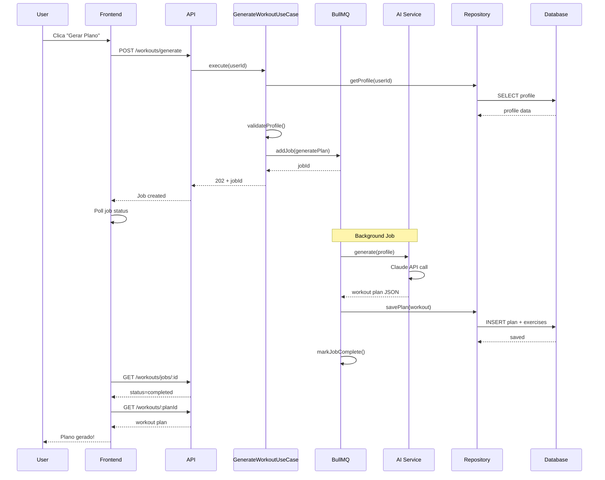

# Módulo de Treinos - Requisitos Funcionais

## Metadata
- **Módulo**: Planos de Treino e Exercícios
- **Versão**: 1.0
- **Última Atualização**: 2026-02-08
- **Status**: Draft
- **Prioridade Geral**: 🔴 Must Have (MVP)

## Visão Geral

O módulo de treinos é o coração do FitLife, responsável por gerar planos de treino personalizados usando IA e permitir que usuários registrem seus treinos executados. A IA analisa o perfil completo (objetivo, nível, equipamentos, restrições) e cria um programa progressivo e adaptado.

Os planos incluem exercícios detalhados com séries, repetições, carga sugerida e instruções. Usuários podem visualizar, seguir e registrar a execução dos treinos para acompanhamento de progresso.

## Personas

### Persona 1: Pedro - Ganho de Massa
- **Nível**: Intermediário
- **Objetivo**: Hipertrofia
- **Equipamento**: Academia completa
- **Frequência**: 5x por semana, 90min

### Persona 2: Laura - Perda de Peso
- **Nível**: Iniciante
- **Objetivo**: Emagrecimento
- **Equipamento**: Casa (halteres básicos)
- **Frequência**: 3x por semana, 45min

## Casos de Uso Principais

1. **UC-WORKOUT-001**: Gerar novo plano de treino com IA
2. **UC-WORKOUT-002**: Visualizar planos de treino
3. **UC-WORKOUT-003**: Visualizar detalhes de exercícios
4. **UC-WORKOUT-004**: Registrar treino executado
5. **UC-WORKOUT-005**: Ver histórico de treinos

---

## Requisitos Funcionais

### RF-WORKOUT-001: Gerar Plano de Treino com IA

**Prioridade**: 🔴 Must Have  
**Status**: Pending

**Descrição**:
O sistema deve gerar um plano de treino personalizado usando IA (Claude/GPT), baseado no perfil completo do usuário. O plano inclui exercícios organizados por dias da semana, com séries, repetições e progressão.

**Critérios de Aceitação**:
- [ ] Usuário com perfil completo pode solicitar geração
- [ ] IA analisa: objetivo, nível, equipamentos, dias disponíveis, tempo, restrições
- [ ] Plano é gerado em até 30 segundos
- [ ] Plano inclui exercícios com detalhes completos
- [ ] Plano respeita dias e tempo disponíveis
- [ ] Plano considera restrições físicas
- [ ] Plano é salvo no banco para reutilização
- [ ] Usuário recebe notificação quando pronto

**Regras de Negócio**:
- **RN-WORKOUT-001**: Máximo 3 planos ativos por usuário
- **RN-WORKOUT-002**: Plano tem duração padrão de 4 semanas
- **RN-WORKOUT-003**: IA deve criar progressão (aumento gradual de carga)
- **RN-WORKOUT-004**: Exercícios devem corresponder ao equipamento disponível
- **RN-WORKOUT-005**: Tempo total dos exercícios ≤ tempo disponível
- **RN-WORKOUT-006**: Mínimo 3 exercícios por treino

**Dependências**:
- RF-PROFILE-001: Perfil completo deve existir
- Serviço de IA (Claude/GPT)

**Entidades do Domínio**:
- `WorkoutPlan` (id, userId, name, goal, level, duration, exercises, createdAt, isActive, generatedByAI)
- `Exercise` (id, workoutPlanId, name, sets, reps, rest, load, day, order, instructions, muscleGroup)

**Use Cases da Aplicação**:
- `GenerateWorkoutPlanUseCase`

**Serviços Externos**:
- `IAIService` (interface)
- `ClaudeAIService` (implementação primária)
- `OpenAIService` (fallback)

**API Endpoints**:
```http
POST /api/v1/workouts/generate
Authorization: Bearer {accessToken}
Content-Type: application/json

Request:
{
  "duration": 28,
  "focus": "hypertrophy"
}

Response (202 Accepted):
{
  "jobId": "uuid",
  "status": "processing",
  "estimatedTime": 25,
  "message": "Your workout plan is being generated"
}

---

GET /api/v1/workouts/jobs/:jobId
Authorization: Bearer {accessToken}

Response (200 OK - Processing):
{
  "status": "processing",
  "progress": 60
}

Response (200 OK - Complete):
{
  "status": "completed",
  "workoutPlanId": "uuid"
}
```

**Validações**:
- `duration`: número inteiro, 7-56 dias (1-8 semanas)
- `focus`: string opcional

**Mensagens de Erro**:
- **E-WORKOUT-001**: "Profile incomplete - please complete your profile first"
- **E-WORKOUT-002**: "Maximum 3 active workout plans reached"
- **E-WORKOUT-003**: "AI service unavailable"
- **E-WORKOUT-004**: "Duration must be between 7 and 56 days"

**Testes Necessários**:
- **Unit**: GenerateWorkoutPlanUseCase cria job
- **Integration**: IA retorna plano válido
- **Integration**: Plano é salvo no banco
- **Integration**: Restrições são respeitadas
- **E2E**: Gerar plano completo e visualizar exercícios

---

### RF-WORKOUT-002: Listar Planos de Treino

**Prioridade**: 🔴 Must Have  
**Status**: Pending

**Descrição**:
Usuário visualiza lista de todos os seus planos de treino (ativos e inativos), com informações resumidas e filtros por status e data.

**Critérios de Aceitação**:
- [ ] Lista todos os planos do usuário
- [ ] Ordenação por data de criação (mais recente primeiro)
- [ ] Filtro por status: ativo/inativo
- [ ] Paginação (10 itens por página)
- [ ] Mostra resumo: nome, objetivo, duração, número de exercícios

**Regras de Negócio**:
- **RN-WORKOUT-007**: Usuário só vê próprios planos
- **RN-WORKOUT-008**: Planos são soft-deleted (isActive flag)

**Dependências**:
- RF-WORKOUT-001: Pelo menos um plano deve existir

**Entidades do Domínio**:
- `WorkoutPlan`

**Use Cases da Aplicação**:
- `ListUserWorkoutPlansUseCase`

**API Endpoints**:
```http
GET /api/v1/workouts?page=1&limit=10&active=true
Authorization: Bearer {accessToken}

Response (200 OK):
{
  "data": [
    {
      "id": "uuid",
      "name": "Muscle Building Program",
      "goal": "GAIN_MUSCLE",
      "level": "INTERMEDIATE",
      "duration": 28,
      "exerciseCount": 24,
      "isActive": true,
      "createdAt": "2026-02-08T00:00:00Z"
    }
  ],
  "pagination": {
    "page": 1,
    "limit": 10,
    "total": 5,
    "totalPages": 1
  }
}
```

**Testes Necessários**:
- **Unit**: ListUserWorkoutPlansUseCase filtra por usuário
- **Integration**: Paginação funciona
- **Integration**: Filtro por status funciona
- **E2E**: Listar planos após criar vários

---

### RF-WORKOUT-003: Visualizar Detalhes do Plano

**Prioridade**: 🔴 Must Have  
**Status**: Pending

**Descrição**:
Usuário visualiza detalhes completos de um plano de treino específico, incluindo todos os exercícios organizados por dia da semana.

**Critérios de Aceitação**:
- [ ] Mostra informações do plano (nome, objetivo, duração)
- [ ] Lista todos os exercícios agrupados por dia
- [ ] Cada exercício mostra: nome, séries, reps, carga, descanso, instruções
- [ ] Inclui progresso: quantos treinos foram completados
- [ ] Permite marcar treino como realizado

**Regras de Negócio**:
- **RN-WORKOUT-009**: Usuário só pode ver próprios planos
- **RN-WORKOUT-010**: Exercícios ordenados por campo 'order'

**Dependências**:
- RF-WORKOUT-001: Plano deve existir

**Entidades do Domínio**:
- `WorkoutPlan`
- `Exercise`

**Use Cases da Aplicação**:
- `GetWorkoutPlanDetailsUseCase`

**API Endpoints**:
```http
GET /api/v1/workouts/:id
Authorization: Bearer {accessToken}

Response (200 OK):
{
  "id": "uuid",
  "name": "Muscle Building Program",
  "goal": "GAIN_MUSCLE",
  "level": "INTERMEDIATE",
  "duration": 28,
  "isActive": true,
  "exercises": [
    {
      "id": "uuid",
      "name": "Barbell Bench Press",
      "sets": "4",
      "reps": "8-10",
      "rest": "90",
      "load": "60kg",
      "day": "monday",
      "order": 1,
      "instructions": "Keep elbows at 45 degrees...",
      "muscleGroup": "CHEST"
    }
  ],
  "completedWorkouts": 5,
  "totalWorkouts": 12,
  "createdAt": "2026-02-08T00:00:00Z"
}
```

**Mensagens de Erro**:
- **E-WORKOUT-101**: "Workout plan not found"
- **E-WORKOUT-102**: "Unauthorized to view this plan"

**Testes Necessários**:
- **Unit**: GetWorkoutPlanDetailsUseCase retorna dados completos
- **Integration**: Exercícios são carregados com plano
- **Integration**: Usuário não pode ver plano de outro
- **E2E**: Visualizar plano gerado

---

### RF-WORKOUT-004: Visualizar Exercícios do Plano

**Prioridade**: 🔴 Must Have  
**Status**: Pending

**Descrição**:
Usuário visualiza lista de exercícios de um dia específico do plano, com todas as informações necessárias para executar o treino.

**Critérios de Aceitação**:
- [ ] Filtrar exercícios por dia da semana
- [ ] Mostrar ordem de execução
- [ ] Mostrar detalhes: séries, reps, carga, descanso
- [ ] Mostrar instruções de execução
- [ ] Indicar grupo muscular trabalhado

**Regras de Negócio**:
- **RN-WORKOUT-011**: Exercícios ordenados por campo 'order'
- **RN-WORKOUT-012**: Instruções devem ser claras e seguras

**Dependências**:
- RF-WORKOUT-003: Plano deve existir

**Entidades do Domínio**:
- `Exercise`
- Enum `MuscleGroup`

**Use Cases da Aplicação**:
- `GetWorkoutPlanDetailsUseCase` (inclui exercícios)

**API Endpoints**:
```http
GET /api/v1/workouts/:id/exercises?day=monday
Authorization: Bearer {accessToken}

Response (200 OK):
{
  "day": "monday",
  "exercises": [
    {
      "id": "uuid",
      "order": 1,
      "name": "Barbell Bench Press",
      "sets": "4",
      "reps": "8-10",
      "rest": "90",
      "load": "60kg",
      "instructions": "...",
      "muscleGroup": "CHEST"
    }
  ]
}
```

**Testes Necessários**:
- **Integration**: Filtro por dia funciona
- **E2E**: Visualizar exercícios de segunda-feira

---

### RF-WORKOUT-005: Registrar Treino Executado

**Prioridade**: 🔴 Must Have  
**Status**: Pending

**Descrição**:
Usuário registra quando completa um treino, salvando data, duração real, feedback e marcando como concluído. Isso permite acompanhar aderência ao plano.

**Critérios de Aceitação**:
- [ ] Usuário seleciona plano e dia executado
- [ ] Registra duração real do treino
- [ ] Pode adicionar nota/feedback
- [ ] Sistema salva registro em WorkoutLog
- [ ] Contador de treinos completados é incrementado
- [ ] Pode registrar retroativamente (data passada)

**Regras de Negócio**:
- **RN-WORKOUT-013**: Treino só pode ser registrado uma vez por dia
- **RN-WORKOUT-014**: Data não pode ser futura
- **RN-WORKOUT-015**: Duração deve ser realista (5-300 minutos)

**Dependências**:
- RF-WORKOUT-001: Plano deve existir

**Entidades do Domínio**:
- `WorkoutLog` (id, userId, workoutPlanId, date, duration, notes, createdAt)

**Use Cases da Aplicação**:
- `RecordWorkoutLogUseCase`

**API Endpoints**:
```http
POST /api/v1/workouts/:planId/logs
Authorization: Bearer {accessToken}

Request:
{
  "date": "2026-02-08",
  "duration": 75,
  "notes": "Aumentei carga no supino, treino intenso!"
}

Response (201 Created):
{
  "id": "uuid",
  "workoutPlanId": "uuid",
  "date": "2026-02-08",
  "duration": 75,
  "notes": "Aumentei carga no supino, treino intenso!",
  "createdAt": "2026-02-08T12:00:00Z"
}
```

**Validações**:
- `date`: formato ISO date, não pode ser futura
- `duration`: número, 5-300 minutos
- `notes`: string opcional, máximo 500 caracteres

**Mensagens de Erro**:
- **E-WORKOUT-201**: "Workout already logged for this date"
- **E-WORKOUT-202**: "Date cannot be in the future"
- **E-WORKOUT-203**: "Duration must be between 5 and 300 minutes"
- **E-WORKOUT-204**: "Workout plan not found"

**Testes Necessários**:
- **Unit**: RecordWorkoutLogUseCase cria log
- **Integration**: Log é salvo no banco
- **Integration**: Duplicata de data retorna erro
- **E2E**: Completar treino e ver no histórico

---

### RF-WORKOUT-006: Ver Histórico de Treinos

**Prioridade**: 🔴 Must Have  
**Status**: Pending

**Descrição**:
Usuário visualiza histórico de todos os treinos executados, com filtros por data, plano e estatísticas gerais (total de treinos, média de duração).

**Critérios de Aceitação**:
- [ ] Lista todos os treinos executados
- [ ] Ordenação por data (mais recente primeiro)
- [ ] Filtro por período (última semana, mês, ano)
- [ ] Filtro por plano específico
- [ ] Mostra estatísticas: total, média de duração, aderência
- [ ] Paginação

**Regras de Negócio**:
- **RN-WORKOUT-016**: Aderência = (treinos realizados / treinos planejados) * 100
- **RN-WORKOUT-017**: Histórico mantido indefinidamente

**Dependências**:
- RF-WORKOUT-005: Pelo menos um treino registrado

**Entidades do Domínio**:
- `WorkoutLog`

**Use Cases da Aplicação**:
- `GetWorkoutHistoryUseCase`

**API Endpoints**:
```http
GET /api/v1/workouts/logs?page=1&limit=20&period=month
Authorization: Bearer {accessToken}

Response (200 OK):
{
  "data": [
    {
      "id": "uuid",
      "workoutPlanId": "uuid",
      "workoutPlanName": "Muscle Building",
      "date": "2026-02-08",
      "duration": 75,
      "notes": "Treino intenso!",
      "createdAt": "2026-02-08T12:00:00Z"
    }
  ],
  "stats": {
    "totalWorkouts": 15,
    "averageDuration": 68,
    "adherence": 85
  },
  "pagination": {
    "page": 1,
    "limit": 20,
    "total": 15
  }
}
```

**Testes Necessários**:
- **Unit**: GetWorkoutHistoryUseCase calcula estatísticas
- **Integration**: Filtros por período funcionam
- **E2E**: Ver histórico completo de treinos

---

### RF-WORKOUT-007: Desativar/Arquivar Plano

**Prioridade**: 🟡 Should Have  
**Status**: Pending

**Descrição**:
Usuário pode desativar um plano de treino quando não quiser mais usá-lo, sem deletar o histórico associado.

**Critérios de Aceitação**:
- [ ] Usuário pode marcar plano como inativo
- [ ] Plano inativo não aparece em listagens ativas
- [ ] Histórico de treinos é mantido
- [ ] Plano pode ser reativado

**Regras de Negócio**:
- **RN-WORKOUT-018**: Planos inativos não são deletados (soft delete)
- **RN-WORKOUT-019**: Histórico sempre acessível via workout logs

**Dependências**:
- RF-WORKOUT-001: Plano deve existir

**Entidades do Domínio**:
- `WorkoutPlan`

**Use Cases da Aplicação**:
- `ArchiveWorkoutPlanUseCase`

**API Endpoints**:
```http
DELETE /api/v1/workouts/:id
Authorization: Bearer {accessToken}

Response (200 OK):
{
  "message": "Workout plan archived",
  "id": "uuid"
}
```

**Testes Necessários**:
- **Integration**: isActive é setado para false
- **Integration**: Plano não aparece em listagem ativa
- **E2E**: Arquivar plano e verificar histórico mantido

---

## Diagrama: Fluxo de Geração de Plano com IA



## Prompt para IA

Template usado para gerar planos:

```
Generate a personalized workout plan with the following parameters:

User Profile:
- Age: {age}
- Gender: {gender}
- Weight: {weight}kg, Height: {height}cm
- Goal: {goal}
- Experience Level: {level}
- Available Equipment: {equipment}
- Available Days: {availableDays}
- Time per Session: {availableTime} minutes
- Physical Restrictions: {restrictions}

Requirements:
- Create exercises for {duration} days
- Respect equipment limitations
- Avoid exercises contraindicated by restrictions
- Include warm-up and cool-down
- Progressive overload principle
- Balance muscle groups

Output Format:
JSON with array of exercises including:
- name, sets, reps, rest, load, day, order, instructions, muscleGroup
```

## Implementação DDD

### Domain Layer

**Arquivo**: `apps/api/src/domain/entities/workout-plan.ts`
```typescript
export class WorkoutPlan {
  constructor(
    public readonly id: UniqueEntityID,
    public readonly userId: UniqueEntityID,
    public name: string,
    public goal: FitnessGoal,
    public level: ExperienceLevel,
    public duration: number,
    public exercises: Exercise[],
    public isActive: boolean,
    public generatedByAI: boolean
  ) {}
  
  addExercise(exercise: Exercise): void {
    this.exercises.push(exercise);
  }
  
  deactivate(): void {
    this.isActive = false;
  }
}
```

### Application Layer

**Arquivo**: `apps/api/src/application/use-cases/workout/generate-workout-plan.use-case.ts`
```typescript
@injectable()
export class GenerateWorkoutPlanUseCase {
  constructor(
    @inject(TYPES.UserProfileRepository)
    private profileRepository: IUserProfileRepository,
    @inject(TYPES.WorkoutPlanRepository)
    private workoutRepository: IWorkoutPlanRepository,
    @inject(TYPES.AIService)
    private aiService: IAIService,
    @inject(TYPES.QueueService)
    private queueService: IQueueService
  ) {}
  
  async execute(userId: string): Promise<{ jobId: string }> {
    // 1. Validar perfil completo
    // 2. Verificar limite de planos ativos
    // 3. Adicionar job na fila
    // 4. Retornar jobId
  }
}
```

## Checklist de Implementação

- [ ] Domain: WorkoutPlan entity
- [ ] Domain: Exercise entity
- [ ] Domain: IWorkoutPlanRepository interface
- [ ] Application: WorkoutDTOs
- [ ] Application: GenerateWorkoutPlanUseCase
- [ ] Application: ListUserWorkoutPlansUseCase
- [ ] Application: GetWorkoutPlanDetailsUseCase
- [ ] Application: RecordWorkoutLogUseCase
- [ ] Infrastructure: PrismaWorkoutPlanRepository
- [ ] Infrastructure: ClaudeAIService integration
- [ ] Infrastructure: BullMQ job processor
- [ ] Infrastructure: WorkoutController
- [ ] Infrastructure: Workout routes
- [ ] Tests: Unit tests
- [ ] Tests: Integration tests
- [ ] Tests: E2E tests com IA mockada
