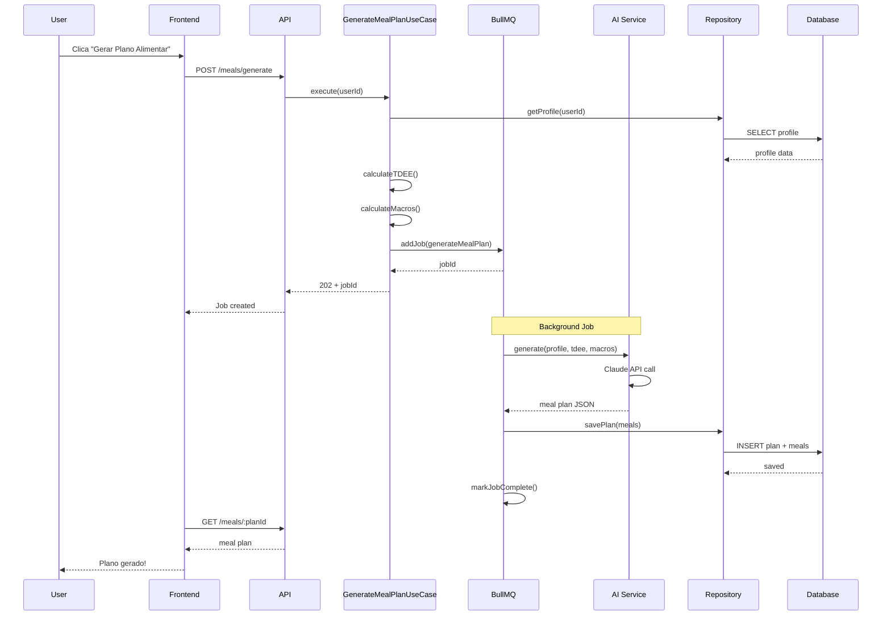

# Módulo de Nutrição - Requisitos Funcionais

## Metadata
- **Módulo**: Planos Alimentares e Refeições
- **Versão**: 1.0
- **Última Atualização**: 2026-02-08
- **Status**: Draft
- **Prioridade Geral**: 🔴 Must Have (MVP)

## Visão Geral

O módulo de nutrição complementa os treinos gerando planos alimentares personalizados usando IA. A IA calcula calorias e macronutrientes (proteínas, carboidratos, gorduras) baseados no objetivo do usuário e cria refeições balanceadas respeitando preferências e restrições dietéticas.

Usuários podem visualizar planos detalhados com receitas, ingredientes e valores nutricionais, além de registrar refeições consumidas para acompanhar aderência à dieta.

## Personas

### Persona 1: Mariana - Vegetariana
- **Objetivo**: Perder peso
- **Restrições**: Vegetariana estrita
- **Refeições**: 5 por dia
- **Necessidade**: Receitas vegetarianas ricas em proteína

### Persona 2: Roberto - Ganho de Massa
- **Objetivo**: Hipertrofia
- **Restrições**: Intolerante à lactose
- **Refeições**: 6 por dia
- **Necessidade**: Alto consumo calórico sem laticínios

## Casos de Uso Principais

1. **UC-NUTRITION-001**: Gerar plano alimentar com IA
2. **UC-NUTRITION-002**: Visualizar planos alimentares
3. **UC-NUTRITION-003**: Visualizar detalhes de refeições
4. **UC-NUTRITION-004**: Registrar refeição consumida
5. **UC-NUTRITION-005**: Ver histórico de alimentação

---

## Requisitos Funcionais

### RF-NUTRITION-001: Gerar Plano Alimentar com IA

**Prioridade**: 🔴 Must Have  
**Status**: Pending

**Descrição**:
O sistema deve gerar um plano alimentar personalizado usando IA, calculando necessidades calóricas baseadas no TDEE (Total Daily Energy Expenditure), distribuindo macronutrientes conforme objetivo e criando refeições balanceadas.

**Critérios de Aceitação**:
- [ ] IA calcula TDEE baseado em idade, peso, altura, nível de atividade
- [ ] Ajusta calorias conforme objetivo (déficit/superávit/manutenção)
- [ ] Distribui macros: proteína, carboidratos, gorduras
- [ ] Gera refeições respeitando preferências e restrições
- [ ] Plano inclui: nome da refeição, ingredientes, porções, preparo, macros
- [ ] Plano respeita número de refeições por dia configurado
- [ ] Geração em até 30 segundos
- [ ] Plano é salvo no banco

**Regras de Negócio**:
- **RN-NUTRITION-001**: TDEE calculado pela fórmula Harris-Benedict revisada
- **RN-NUTRITION-002**: Déficit calórico: -500 kcal (perda ~0.5kg/semana)
- **RN-NUTRITION-003**: Superávit calórico: +300-500 kcal (ganho de massa)
- **RN-NUTRITION-004**: Distribuição de macros por objetivo:
  - Perda de peso: 40% proteína, 30% carbo, 30% gordura
  - Ganho de massa: 30% proteína, 45% carbo, 25% gordura
  - Manutenção: 25% proteína, 45% carbo, 30% gordura
- **RN-NUTRITION-005**: Restrições dietéticas são obrigatoriamente respeitadas
- **RN-NUTRITION-006**: Máximo 3 planos ativos por usuário

**Dependências**:
- RF-PROFILE-001: Perfil completo deve existir
- RF-PROFILE-005: Preferências alimentares configuradas
- Serviço de IA (Claude/GPT)

**Entidades do Domínio**:
- `MealPlan` (id, userId, name, targetCalories, targetProtein, targetCarbs, targetFat, duration, meals, isActive, generatedByAI, createdAt)
- `Meal` (id, mealPlanId, name, mealType, ingredients, instructions, calories, protein, carbs, fat, day, order)

**Use Cases da Aplicação**:
- `GenerateMealPlanUseCase`

**Serviços Externos**:
- `IAIService` (interface)
- `ClaudeAIService` (implementação primária)

**API Endpoints**:
```http
POST /api/v1/meals/generate
Authorization: Bearer {accessToken}
Content-Type: application/json

Request:
{
  "duration": 28,
  "focus": "high_protein"
}

Response (202 Accepted):
{
  "jobId": "uuid",
  "status": "processing",
  "estimatedTime": 25,
  "message": "Your meal plan is being generated"
}

---

GET /api/v1/meals/jobs/:jobId
Authorization: Bearer {accessToken}

Response (200 OK - Complete):
{
  "status": "completed",
  "mealPlanId": "uuid"
}
```

**Validações**:
- `duration`: número inteiro, 7-56 dias (1-8 semanas)
- `focus`: string opcional

**Mensagens de Erro**:
- **E-NUTRITION-001**: "Profile incomplete - dietary preferences required"
- **E-NUTRITION-002**: "Maximum 3 active meal plans reached"
- **E-NUTRITION-003**: "AI service unavailable"

**Testes Necessários**:
- **Unit**: Cálculo de TDEE correto
- **Unit**: Ajuste de calorias por objetivo
- **Integration**: IA retorna plano válido
- **Integration**: Restrições são respeitadas
- **E2E**: Gerar plano vegetariano e verificar ausência de carne

---

### RF-NUTRITION-002: Listar Planos Alimentares

**Prioridade**: 🔴 Must Have  
**Status**: Pending

**Descrição**:
Usuário visualiza lista de todos os seus planos alimentares (ativos e inativos), com informações resumidas e filtros.

**Critérios de Aceitação**:
- [ ] Lista todos os planos do usuário
- [ ] Ordenação por data de criação (mais recente primeiro)
- [ ] Filtro por status: ativo/inativo
- [ ] Paginação (10 itens por página)
- [ ] Mostra resumo: nome, calorias alvo, duração, número de refeições

**Regras de Negócio**:
- **RN-NUTRITION-007**: Usuário só vê próprios planos
- **RN-NUTRITION-008**: Planos são soft-deleted (isActive flag)

**Dependências**:
- RF-NUTRITION-001: Pelo menos um plano deve existir

**Entidades do Domínio**:
- `MealPlan`

**Use Cases da Aplicação**:
- `ListUserMealPlansUseCase`

**API Endpoints**:
```http
GET /api/v1/meals?page=1&limit=10&active=true
Authorization: Bearer {accessToken}

Response (200 OK):
{
  "data": [
    {
      "id": "uuid",
      "name": "Weight Loss Plan",
      "targetCalories": 1800,
      "duration": 28,
      "mealCount": 20,
      "isActive": true,
      "createdAt": "2026-02-08T00:00:00Z"
    }
  ],
  "pagination": {
    "page": 1,
    "limit": 10,
    "total": 3
  }
}
```

**Testes Necessários**:
- **Unit**: ListUserMealPlansUseCase filtra por usuário
- **Integration**: Paginação funciona
- **E2E**: Listar planos após criar vários

---

### RF-NUTRITION-003: Visualizar Detalhes do Plano

**Prioridade**: 🔴 Must Have  
**Status**: Pending

**Descrição**:
Usuário visualiza detalhes completos de um plano alimentar, incluindo todas as refeições com valores nutricionais e receitas.

**Critérios de Aceitação**:
- [ ] Mostra informações do plano (calorias, macros alvo)
- [ ] Lista todas as refeições agrupadas por dia
- [ ] Cada refeição mostra: nome, tipo, ingredientes, preparo, macros
- [ ] Soma diária de calorias e macros
- [ ] Inclui progresso: quantas refeições foram registradas

**Regras de Negócio**:
- **RN-NUTRITION-009**: Usuário só pode ver próprios planos
- **RN-NUTRITION-010**: Refeições ordenadas por campo 'order'

**Dependências**:
- RF-NUTRITION-001: Plano deve existir

**Entidades do Domínio**:
- `MealPlan`
- `Meal`

**Use Cases da Aplicação**:
- `GetMealPlanDetailsUseCase`

**API Endpoints**:
```http
GET /api/v1/meals/:id
Authorization: Bearer {accessToken}

Response (200 OK):
{
  "id": "uuid",
  "name": "Weight Loss Plan",
  "targetCalories": 1800,
  "targetProtein": 135,
  "targetCarbs": 180,
  "targetFat": 60,
  "duration": 28,
  "isActive": true,
  "meals": [
    {
      "id": "uuid",
      "name": "Oatmeal com Frutas",
      "mealType": "BREAKFAST",
      "ingredients": [
        "100g aveia em flocos",
        "200ml leite desnatado",
        "1 banana média",
        "1 colher de mel"
      ],
      "instructions": "Cozinhe a aveia no leite...",
      "calories": 350,
      "protein": 15,
      "carbs": 60,
      "fat": 5,
      "day": "monday",
      "order": 1
    }
  ],
  "completedMeals": 12,
  "totalMeals": 84,
  "createdAt": "2026-02-08T00:00:00Z"
}
```

**Mensagens de Erro**:
- **E-NUTRITION-101**: "Meal plan not found"
- **E-NUTRITION-102**: "Unauthorized to view this plan"

**Testes Necessários**:
- **Unit**: GetMealPlanDetailsUseCase retorna dados completos
- **Integration**: Refeições são carregadas com plano
- **E2E**: Visualizar plano gerado

---

### RF-NUTRITION-004: Visualizar Refeições do Plano

**Prioridade**: 🔴 Must Have  
**Status**: Pending

**Descrição**:
Usuário visualiza lista de refeições de um dia específico do plano, com receitas detalhadas e valores nutricionais.

**Critérios de Aceitação**:
- [ ] Filtrar refeições por dia da semana
- [ ] Mostrar ordem das refeições (café, almoço, jantar, etc)
- [ ] Mostrar ingredientes com quantidades
- [ ] Mostrar instruções de preparo
- [ ] Mostrar valores nutricionais por refeição e total do dia

**Regras de Negócio**:
- **RN-NUTRITION-011**: Refeições ordenadas por campo 'order'
- **RN-NUTRITION-012**: Ingredientes com unidades de medida claras

**Dependências**:
- RF-NUTRITION-003: Plano deve existir

**Entidades do Domínio**:
- `Meal`
- Enum `MealType` (BREAKFAST, LUNCH, DINNER, SNACK)

**Use Cases da Aplicação**:
- `GetMealPlanDetailsUseCase` (inclui refeições)

**API Endpoints**:
```http
GET /api/v1/meals/:id/meals?day=monday
Authorization: Bearer {accessToken}

Response (200 OK):
{
  "day": "monday",
  "meals": [
    {
      "id": "uuid",
      "order": 1,
      "name": "Oatmeal com Frutas",
      "mealType": "BREAKFAST",
      "ingredients": [...],
      "instructions": "...",
      "calories": 350,
      "protein": 15,
      "carbs": 60,
      "fat": 5
    }
  ],
  "totalCalories": 1780,
  "totalProtein": 130,
  "totalCarbs": 175,
  "totalFat": 58
}
```

**Testes Necessários**:
- **Integration**: Filtro por dia funciona
- **E2E**: Visualizar refeições de segunda-feira

---

### RF-NUTRITION-005: Registrar Refeição Consumida

**Prioridade**: 🔴 Must Have  
**Status**: Pending

**Descrição**:
Usuário registra quando consome uma refeição do plano, salvando data, hora e feedback. Isso permite acompanhar aderência à dieta.

**Critérios de Aceitação**:
- [ ] Usuário seleciona plano e refeição consumida
- [ ] Registra data e hora da refeição
- [ ] Pode adicionar nota/feedback
- [ ] Sistema salva registro em MealLog
- [ ] Contador de refeições consumidas é incrementado
- [ ] Pode registrar retroativamente

**Regras de Negócio**:
- **RN-NUTRITION-013**: Mesma refeição pode ser registrada múltiplas vezes por dia (ex: 2 lanches)
- **RN-NUTRITION-014**: Data não pode ser futura

**Dependências**:
- RF-NUTRITION-001: Plano deve existir

**Entidades do Domínio**:
- `MealLog` (id, userId, mealPlanId, mealId, date, notes, createdAt)

**Use Cases da Aplicação**:
- `RecordMealLogUseCase`

**API Endpoints**:
```http
POST /api/v1/meals/:planId/logs
Authorization: Bearer {accessToken}

Request:
{
  "mealId": "uuid",
  "date": "2026-02-08",
  "time": "08:30",
  "notes": "Substituí banana por morango"
}

Response (201 Created):
{
  "id": "uuid",
  "mealPlanId": "uuid",
  "mealId": "uuid",
  "date": "2026-02-08T08:30:00Z",
  "notes": "Substituí banana por morango",
  "createdAt": "2026-02-08T08:35:00Z"
}
```

**Validações**:
- `mealId`: UUID válido
- `date`: formato ISO date, não pode ser futura
- `time`: formato HH:mm
- `notes`: string opcional, máximo 500 caracteres

**Mensagens de Erro**:
- **E-NUTRITION-201**: "Date cannot be in the future"
- **E-NUTRITION-202**: "Meal not found in this plan"
- **E-NUTRITION-203**: "Meal plan not found"

**Testes Necessários**:
- **Unit**: RecordMealLogUseCase cria log
- **Integration**: Log é salvo no banco
- **E2E**: Registrar refeição e ver no histórico

---

### RF-NUTRITION-006: Ver Histórico de Alimentação

**Prioridade**: 🔴 Must Have  
**Status**: Pending

**Descrição**:
Usuário visualiza histórico de todas as refeições consumidas, com filtros por data, plano e estatísticas gerais (total de refeições, aderência).

**Critérios de Aceitação**:
- [ ] Lista todas as refeições consumidas
- [ ] Ordenação por data (mais recente primeiro)
- [ ] Filtro por período (última semana, mês, ano)
- [ ] Filtro por plano específico
- [ ] Mostra estatísticas: total, aderência, calorias médias
- [ ] Paginação

**Regras de Negócio**:
- **RN-NUTRITION-015**: Aderência = (refeições consumidas / refeições planejadas) * 100
- **RN-NUTRITION-016**: Histórico mantido indefinidamente

**Dependências**:
- RF-NUTRITION-005: Pelo menos uma refeição registrada

**Entidades do Domínio**:
- `MealLog`

**Use Cases da Aplicação**:
- `GetMealHistoryUseCase`

**API Endpoints**:
```http
GET /api/v1/meals/logs?page=1&limit=20&period=week
Authorization: Bearer {accessToken}

Response (200 OK):
{
  "data": [
    {
      "id": "uuid",
      "mealPlanId": "uuid",
      "mealPlanName": "Weight Loss Plan",
      "mealId": "uuid",
      "mealName": "Oatmeal com Frutas",
      "date": "2026-02-08T08:30:00Z",
      "calories": 350,
      "protein": 15,
      "notes": "Substituí banana",
      "createdAt": "2026-02-08T08:35:00Z"
    }
  ],
  "stats": {
    "totalMeals": 45,
    "averageCalories": 1820,
    "adherence": 90
  },
  "pagination": {
    "page": 1,
    "limit": 20,
    "total": 45
  }
}
```

**Testes Necessários**:
- **Unit**: GetMealHistoryUseCase calcula estatísticas
- **Integration**: Filtros por período funcionam
- **E2E**: Ver histórico completo de refeições

---

### RF-NUTRITION-007: Calcular TDEE Automaticamente

**Prioridade**: 🔴 Must Have  
**Status**: Pending

**Descrição**:
Sistema calcula automaticamente o TDEE (Total Daily Energy Expenditure) do usuário baseado em idade, peso, altura, gênero e nível de atividade física.

**Critérios de Aceitação**:
- [ ] TDEE calculado usando fórmula Harris-Benedict revisada
- [ ] Considera nível de atividade física (multiplicador)
- [ ] Valores são atualizados quando perfil muda
- [ ] Frontend exibe TDEE com explicação

**Regras de Negócio**:
- **RN-NUTRITION-017**: Fórmula Harris-Benedict revisada:
  - Homens: BMR = 88.362 + (13.397 × peso) + (4.799 × altura) - (5.677 × idade)
  - Mulheres: BMR = 447.593 + (9.247 × peso) + (3.098 × altura) - (4.330 × idade)
- **RN-NUTRITION-018**: Multiplicadores de atividade:
  - Sedentário: BMR × 1.2
  - Leve (1-3 dias/semana): BMR × 1.375
  - Moderado (3-5 dias/semana): BMR × 1.55
  - Intenso (6-7 dias/semana): BMR × 1.725
  - Muito intenso (atleta): BMR × 1.9

**Dependências**:
- RF-PROFILE-001: Perfil completo deve existir

**Entidades do Domínio**:
- `UserProfile`
- `TDEE` (Value Object - calculado)

**Use Cases da Aplicação**:
- `CalculateTDEEUseCase`

**API Endpoints**:
```http
GET /api/v1/profiles/me/tdee
Authorization: Bearer {accessToken}

Response (200 OK):
{
  "bmr": 1850,
  "activityLevel": "MODERATE",
  "tdee": 2868,
  "explanation": "Based on your profile, your body burns approximately 2868 calories per day"
}
```

**Testes Necessários**:
- **Unit**: Cálculo de BMR correto por gênero
- **Unit**: Multiplicadores de atividade corretos
- **Integration**: TDEE é calculado corretamente

---

### RF-NUTRITION-008: Desativar/Arquivar Plano Alimentar

**Prioridade**: 🟡 Should Have  
**Status**: Pending

**Descrição**:
Usuário pode desativar um plano alimentar quando não quiser mais usá-lo, sem deletar o histórico associado.

**Critérios de Aceitação**:
- [ ] Usuário pode marcar plano como inativo
- [ ] Plano inativo não aparece em listagens ativas
- [ ] Histórico de refeições é mantido
- [ ] Plano pode ser reativado

**Regras de Negócio**:
- **RN-NUTRITION-019**: Planos inativos não são deletados (soft delete)
- **RN-NUTRITION-020**: Histórico sempre acessível via meal logs

**Dependências**:
- RF-NUTRITION-001: Plano deve existir

**Entidades do Domínio**:
- `MealPlan`

**Use Cases da Aplicação**:
- `ArchiveMealPlanUseCase`

**API Endpoints**:
```http
DELETE /api/v1/meals/:id
Authorization: Bearer {accessToken}

Response (200 OK):
{
  "message": "Meal plan archived",
  "id": "uuid"
}
```

**Testes Necessários**:
- **Integration**: isActive é setado para false
- **Integration**: Plano não aparece em listagem ativa
- **E2E**: Arquivar plano e verificar histórico mantido

---

## Diagrama: Fluxo de Geração de Plano com IA



## Prompt para IA

Template usado para gerar planos:

```
Generate a personalized meal plan with the following parameters:

User Profile:
- Age: {age}, Gender: {gender}
- Weight: {weight}kg, Height: {height}cm
- Goal: {goal}
- TDEE: {tdee} kcal/day
- Target Calories: {targetCalories} kcal/day
- Target Macros: {protein}g protein, {carbs}g carbs, {fat}g fat
- Meals per Day: {mealsPerDay}
- Dietary Restrictions: {dietaryRestrictions}

Requirements:
- Create {mealsPerDay} meals per day
- Total daily calories = {targetCalories}
- Respect dietary restrictions strictly
- Include ingredient quantities and preparation instructions
- Balance macros across meals
- Use simple, accessible ingredients
- Include variety across days

Output Format:
JSON with array of meals including:
- name, mealType, ingredients[], instructions, calories, protein, carbs, fat, day, order
```

## Implementação DDD

### Domain Layer

**Arquivo**: `apps/api/src/domain/entities/meal-plan.ts`
```typescript
export class MealPlan {
  constructor(
    public readonly id: UniqueEntityID,
    public readonly userId: UniqueEntityID,
    public name: string,
    public targetCalories: number,
    public targetProtein: number,
    public targetCarbs: number,
    public targetFat: number,
    public duration: number,
    public meals: Meal[],
    public isActive: boolean,
    public generatedByAI: boolean
  ) {}
  
  addMeal(meal: Meal): void {
    this.meals.push(meal);
  }
  
  calculateDailyTotals(day: string): NutritionTotals {
    // Soma calorias e macros do dia
  }
}
```

**Arquivo**: `apps/api/src/domain/value-objects/tdee.ts`
```typescript
export class TDEE {
  constructor(
    public readonly bmr: number,
    public readonly tdee: number,
    public readonly activityLevel: ActivityLevel
  ) {}
  
  static calculate(profile: UserProfile): TDEE {
    // Implementa Harris-Benedict
  }
  
  getTargetCalories(goal: FitnessGoal): number {
    // Ajusta conforme objetivo
  }
}
```

### Application Layer

**Arquivo**: `apps/api/src/application/use-cases/nutrition/generate-meal-plan.use-case.ts`
```typescript
@injectable()
export class GenerateMealPlanUseCase {
  constructor(
    @inject(TYPES.UserProfileRepository)
    private profileRepository: IUserProfileRepository,
    @inject(TYPES.MealPlanRepository)
    private mealRepository: IMealPlanRepository,
    @inject(TYPES.AIService)
    private aiService: IAIService,
    @inject(TYPES.QueueService)
    private queueService: IQueueService
  ) {}
  
  async execute(userId: string): Promise<{ jobId: string }> {
    // 1. Validar perfil completo
    // 2. Calcular TDEE e calorias alvo
    // 3. Calcular macros
    // 4. Adicionar job na fila
    // 5. Retornar jobId
  }
}
```

## Checklist de Implementação

- [ ] Domain: MealPlan entity
- [ ] Domain: Meal entity
- [ ] Domain: TDEE value object
- [ ] Domain: IMealPlanRepository interface
- [ ] Application: MealDTOs
- [ ] Application: GenerateMealPlanUseCase
- [ ] Application: CalculateTDEEUseCase
- [ ] Application: ListUserMealPlansUseCase
- [ ] Application: GetMealPlanDetailsUseCase
- [ ] Application: RecordMealLogUseCase
- [ ] Infrastructure: PrismaMealPlanRepository
- [ ] Infrastructure: ClaudeAIService integration
- [ ] Infrastructure: BullMQ job processor
- [ ] Infrastructure: MealController
- [ ] Infrastructure: Meal routes
- [ ] Tests: Unit tests (TDEE, macros)
- [ ] Tests: Integration tests
- [ ] Tests: E2E tests com IA mockada
