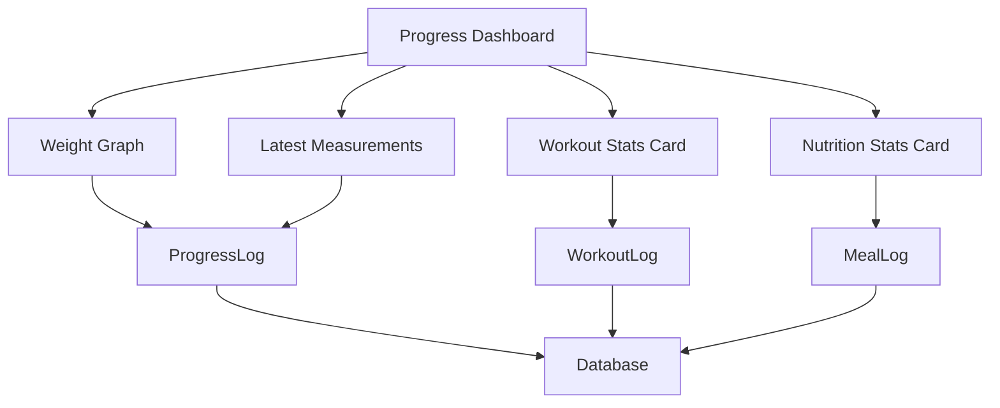

# Módulo de Progresso - Requisitos Funcionais

## Metadata
- **Módulo**: Acompanhamento de Progresso
- **Versão**: 1.0
- **Última Atualização**: 2026-02-08
- **Status**: Draft
- **Prioridade Geral**: 🔴 Must Have (MVP)

## Visão Geral

O módulo de progresso permite que usuários acompanhem sua evolução ao longo do tempo, registrando medidas corporais, peso e visualizando estatísticas de treinos e alimentação. É o módulo de feedback visual que mantém usuários motivados ao mostrar resultados concretos.

Os dados de progresso são consolidados a partir de workout logs, meal logs e registros manuais de medidas, gerando gráficos, insights e comparações periódicas.

## Personas

### Persona 1: Fernanda - Perda de Peso
- **Objetivo**: Perder 10kg em 3 meses
- **Interesse**: Ver evolução de peso semanal e aderência à dieta
- **Motivação**: Gráficos visuais de progresso

### Persona 2: Gustavo - Ganho de Massa
- **Objetivo**: Ganhar 5kg de massa magra
- **Interesse**: Acompanhar medidas (braço, peito, perna) e comparar fotos
- **Motivação**: Estatísticas de treinos completados

## Casos de Uso Principais

1. **UC-PROGRESS-001**: Registrar medidas corporais
2. **UC-PROGRESS-002**: Ver evolução de peso
3. **UC-PROGRESS-003**: Ver estatísticas de treinos
4. **UC-PROGRESS-004**: Ver estatísticas de alimentação
5. **UC-PROGRESS-005**: Comparar períodos (antes/depois)

---

## Requisitos Funcionais

### RF-PROGRESS-001: Registrar Medidas Corporais

**Prioridade**: 🔴 Must Have  
**Status**: Pending

**Descrição**:
Usuário pode registrar manualmente medidas corporais (peso, cintura, quadril, braço, peito, coxa) em datas específicas para acompanhar evolução física além da balança.

**Critérios de Aceitação**:
- [ ] Usuário registra peso (obrigatório) e medidas opcionais
- [ ] Data do registro pode ser escolhida (padrão: hoje)
- [ ] Sistema aceita múltiplas medidas: cintura, quadril, braço direito/esquerdo, peito, coxa direita/esquerda
- [ ] Unidades: peso (kg), medidas (cm)
- [ ] Registro é salvo em ProgressLog
- [ ] Usuário pode adicionar nota/observação

**Regras de Negócio**:
- **RN-PROGRESS-001**: Apenas um registro de medidas por dia
- **RN-PROGRESS-002**: Peso: 30-300 kg
- **RN-PROGRESS-003**: Medidas: 10-200 cm
- **RN-PROGRESS-004**: Data não pode ser futura

**Dependências**:
- RF-PROFILE-001: Perfil deve existir

**Entidades do Domínio**:
- `ProgressLog` (id, userId, date, weight, waist, hip, chest, rightArm, leftArm, rightThigh, leftThigh, notes, createdAt)

**Use Cases da Aplicação**:
- `RecordProgressLogUseCase`

**API Endpoints**:
```http
POST /api/v1/progress
Authorization: Bearer {accessToken}
Content-Type: application/json

Request:
{
  "date": "2026-02-08",
  "weight": 78.5,
  "waist": 85,
  "hip": 95,
  "chest": 100,
  "rightArm": 35,
  "leftArm": 34.5,
  "rightThigh": 55,
  "leftThigh": 54.5,
  "notes": "Medidas após 2 semanas de treino"
}

Response (201 Created):
{
  "id": "uuid",
  "userId": "uuid",
  "date": "2026-02-08",
  "weight": 78.5,
  "waist": 85,
  "hip": 95,
  "chest": 100,
  "rightArm": 35,
  "leftArm": 34.5,
  "rightThigh": 55,
  "leftThigh": 54.5,
  "notes": "Medidas após 2 semanas de treino",
  "createdAt": "2026-02-08T10:00:00Z"
}
```

**Validações**:
- `date`: formato ISO date, não futura
- `weight`: número decimal, 30-300 kg (obrigatório)
- `waist`, `hip`, `chest`, arms, thighs: números decimais, 10-200 cm (opcionais)
- `notes`: string opcional, máximo 500 caracteres

**Mensagens de Erro**:
- **E-PROGRESS-001**: "Progress already logged for this date"
- **E-PROGRESS-002**: "Date cannot be in the future"
- **E-PROGRESS-003**: "Weight must be between 30 and 300 kg"
- **E-PROGRESS-004**: "Measurement must be between 10 and 200 cm"

**Testes Necessários**:
- **Unit**: RecordProgressLogUseCase valida ranges
- **Integration**: Registro é salvo no banco
- **Integration**: Duplicata de data retorna erro
- **E2E**: Registrar medidas e visualizar em gráfico

---

### RF-PROGRESS-002: Ver Evolução de Peso

**Prioridade**: 🔴 Must Have  
**Status**: Pending

**Descrição**:
Usuário visualiza gráfico de evolução de peso ao longo do tempo, com filtros de período e estatísticas (variação total, média, tendência).

**Critérios de Aceitação**:
- [ ] Gráfico de linha mostrando peso x data
- [ ] Filtros: última semana, mês, 3 meses, 6 meses, ano, todo período
- [ ] Estatísticas: peso inicial, atual, variação, peso médio
- [ ] Indicador de tendência (perda/ganho/estável)
- [ ] Dados exportáveis (CSV/JSON)

**Regras de Negócio**:
- **RN-PROGRESS-005**: Tendência baseada em média móvel de 7 dias
- **RN-PROGRESS-006**: Variação considerada estável se < 0.5kg/semana

**Dependências**:
- RF-PROGRESS-001: Pelo menos um registro de peso

**Entidades do Domínio**:
- `ProgressLog`

**Use Cases da Aplicação**:
- `GetWeightProgressUseCase`

**API Endpoints**:
```http
GET /api/v1/progress/weight?period=month
Authorization: Bearer {accessToken}

Response (200 OK):
{
  "data": [
    {
      "date": "2026-01-08",
      "weight": 82.0
    },
    {
      "date": "2026-01-15",
      "weight": 81.5
    },
    {
      "date": "2026-02-01",
      "weight": 80.0
    },
    {
      "date": "2026-02-08",
      "weight": 78.5
    }
  ],
  "stats": {
    "initialWeight": 82.0,
    "currentWeight": 78.5,
    "totalChange": -3.5,
    "averageWeight": 80.5,
    "trend": "LOSING",
    "averageChangePerWeek": -0.8
  }
}
```

**Testes Necessários**:
- **Unit**: Cálculo de estatísticas correto
- **Unit**: Tendência identificada corretamente
- **Integration**: Filtros de período funcionam
- **E2E**: Visualizar gráfico de evolução

---

### RF-PROGRESS-003: Ver Estatísticas de Treinos

**Prioridade**: 🔴 Must Have  
**Status**: Pending

**Descrição**:
Usuário visualiza estatísticas consolidadas de treinos: total de treinos, duração média, aderência ao plano, treinos por semana, etc.

**Critérios de Aceitação**:
- [ ] Total de treinos executados (período selecionado)
- [ ] Duração média dos treinos
- [ ] Taxa de aderência ao plano (%)
- [ ] Treinos por semana (média)
- [ ] Gráfico de treinos por mês
- [ ] Streak (dias consecutivos de treino)

**Regras de Negócio**:
- **RN-PROGRESS-007**: Aderência = (treinos executados / treinos planejados) * 100
- **RN-PROGRESS-008**: Streak quebra após 2 dias sem treino

**Dependências**:
- RF-WORKOUT-005: Pelo menos um treino registrado

**Entidades do Domínio**:
- `WorkoutLog`

**Use Cases da Aplicação**:
- `GetWorkoutStatsUseCase`

**API Endpoints**:
```http
GET /api/v1/progress/workouts?period=month
Authorization: Bearer {accessToken}

Response (200 OK):
{
  "totalWorkouts": 18,
  "averageDuration": 72,
  "adherenceRate": 85,
  "workoutsPerWeek": 4.5,
  "currentStreak": 7,
  "longestStreak": 12,
  "chartData": [
    {
      "week": "2026-W05",
      "count": 4
    },
    {
      "week": "2026-W06",
      "count": 5
    }
  ]
}
```

**Testes Necessários**:
- **Unit**: Cálculo de aderência correto
- **Unit**: Cálculo de streak correto
- **Integration**: Estatísticas agregam dados corretamente
- **E2E**: Visualizar estatísticas após vários treinos

---

### RF-PROGRESS-004: Ver Estatísticas de Alimentação

**Prioridade**: 🔴 Must Have  
**Status**: Pending

**Descrição**:
Usuário visualiza estatísticas consolidadas de alimentação: total de refeições, calorias médias, aderência ao plano, macros médios.

**Critérios de Aceitação**:
- [ ] Total de refeições registradas
- [ ] Calorias médias consumidas/dia
- [ ] Comparação com meta de calorias
- [ ] Taxa de aderência ao plano (%)
- [ ] Macros médios: proteína, carboidratos, gorduras
- [ ] Gráfico de calorias por dia

**Regras de Negócio**:
- **RN-PROGRESS-009**: Aderência = (refeições registradas / refeições planejadas) * 100
- **RN-PROGRESS-010**: Calorias diárias somam todas as refeições do dia

**Dependências**:
- RF-NUTRITION-005: Pelo menos uma refeição registrada

**Entidades do Domínio**:
- `MealLog`
- `Meal`

**Use Cases da Aplicação**:
- `GetNutritionStatsUseCase`

**API Endpoints**:
```http
GET /api/v1/progress/nutrition?period=week
Authorization: Bearer {accessToken}

Response (200 OK):
{
  "totalMeals": 28,
  "averageCalories": 1850,
  "targetCalories": 1800,
  "adherenceRate": 93,
  "averageMacros": {
    "protein": 138,
    "carbs": 182,
    "fat": 58
  },
  "chartData": [
    {
      "date": "2026-02-01",
      "calories": 1820,
      "meals": 4
    },
    {
      "date": "2026-02-02",
      "calories": 1780,
      "meals": 4
    }
  ]
}
```

**Testes Necessários**:
- **Unit**: Cálculo de calorias médias correto
- **Unit**: Agregação de macros correta
- **Integration**: Estatísticas incluem refeições e valores nutricionais
- **E2E**: Visualizar estatísticas após várias refeições

---

### RF-PROGRESS-005: Exportar Dados de Progresso

**Prioridade**: 🟡 Should Have  
**Status**: Pending

**Descrição**:
Usuário pode exportar todos os seus dados de progresso (medidas, treinos, refeições) em formato CSV ou JSON para análise externa ou backup.

**Critérios de Aceitação**:
- [ ] Exportar todos os dados ou filtrar por tipo
- [ ] Formatos disponíveis: CSV, JSON
- [ ] Inclui todos os campos relevantes
- [ ] Download direto via API

**Regras de Negócio**:
- **RN-PROGRESS-011**: Exportação é síncrona (sem fila)
- **RN-PROGRESS-012**: Máximo 1 ano de dados por exportação

**Dependências**:
- RF-PROGRESS-001: Dados devem existir

**Entidades do Domínio**:
- `ProgressLog`
- `WorkoutLog`
- `MealLog`

**Use Cases da Aplicação**:
- `ExportProgressDataUseCase`

**API Endpoints**:
```http
GET /api/v1/progress/export?format=csv&type=all&period=year
Authorization: Bearer {accessToken}

Response (200 OK):
Content-Type: text/csv
Content-Disposition: attachment; filename="progress-export-2026-02-08.csv"

date,weight,waist,hip,chest,rightArm,leftArm,rightThigh,leftThigh,notes
2026-01-08,82.0,88,98,102,36,35.5,56,55.5,"Início"
2026-02-08,78.5,85,95,100,35,34.5,55,54.5,"Após 1 mês"
```

**Testes Necessários**:
- **Unit**: Geração de CSV correto
- **Integration**: Exportação retorna dados completos
- **E2E**: Exportar e validar formato

---

### RF-PROGRESS-006: Comparar Períodos (Antes/Depois)

**Prioridade**: 🟡 Should Have  
**Status**: Pending

**Descrição**:
Usuário pode comparar medidas e estatísticas entre dois períodos (ex: mês 1 vs mês 3), visualizando mudanças absolutas e percentuais.

**Critérios de Aceitação**:
- [ ] Selecionar duas datas de referência
- [ ] Comparar peso e medidas corporais
- [ ] Calcular mudança absoluta e percentual
- [ ] Mostrar indicador visual (positivo/negativo conforme objetivo)
- [ ] Comparar estatísticas de treino e alimentação

**Regras de Negócio**:
- **RN-PROGRESS-013**: Mudança positiva depende do objetivo (perder peso: negativo é bom, ganhar músculo: positivo é bom)
- **RN-PROGRESS-014**: Comparação usa registros mais próximos às datas selecionadas

**Dependências**:
- RF-PROGRESS-001: Pelo menos dois registros em datas diferentes

**Entidades do Domínio**:
- `ProgressLog`

**Use Cases da Aplicação**:
- `CompareProgressPeriodsUseCase`

**API Endpoints**:
```http
GET /api/v1/progress/compare?from=2026-01-01&to=2026-02-08
Authorization: Bearer {accessToken}

Response (200 OK):
{
  "from": {
    "date": "2026-01-08",
    "weight": 82.0,
    "waist": 88,
    "chest": 102
  },
  "to": {
    "date": "2026-02-08",
    "weight": 78.5,
    "waist": 85,
    "chest": 100
  },
  "changes": {
    "weight": {
      "absolute": -3.5,
      "percentage": -4.27,
      "indicator": "POSITIVE"
    },
    "waist": {
      "absolute": -3,
      "percentage": -3.41,
      "indicator": "POSITIVE"
    },
    "chest": {
      "absolute": -2,
      "percentage": -1.96,
      "indicator": "NEUTRAL"
    }
  },
  "goal": "LOSE_WEIGHT"
}
```

**Testes Necessários**:
- **Unit**: Cálculo de mudança percentual correto
- **Unit**: Indicador positivo/negativo conforme objetivo
- **Integration**: Comparação busca registros corretos
- **E2E**: Comparar antes/depois e validar resultados

---

### RF-PROGRESS-007: Dashboard de Progresso

**Prioridade**: 🔴 Must Have  
**Status**: Pending

**Descrição**:
Página centralizada que consolida todas as informações de progresso: gráfico de peso, estatísticas de treino, estatísticas de alimentação e últimas medidas registradas.

**Critérios de Aceitação**:
- [ ] Gráfico de evolução de peso (últimos 30 dias)
- [ ] Card de estatísticas de treinos (semana atual)
- [ ] Card de estatísticas de alimentação (semana atual)
- [ ] Últimas medidas corporais registradas
- [ ] Atalho para registrar novas medidas
- [ ] Resumo visual de aderência geral

**Regras de Negócio**:
- **RN-PROGRESS-015**: Dashboard mostra dados dos últimos 30 dias por padrão
- **RN-PROGRESS-016**: Aderência geral = média de aderência de treino e alimentação

**Dependências**:
- RF-PROGRESS-001: Dados de progresso
- RF-PROGRESS-003: Estatísticas de treinos
- RF-PROGRESS-004: Estatísticas de alimentação

**Entidades do Domínio**:
- `ProgressLog`
- `WorkoutLog`
- `MealLog`

**Use Cases da Aplicação**:
- `GetProgressDashboardUseCase`

**API Endpoints**:
```http
GET /api/v1/progress/dashboard
Authorization: Bearer {accessToken}

Response (200 OK):
{
  "weightProgress": {
    "current": 78.5,
    "change": -3.5,
    "trend": "LOSING",
    "chartData": [...]
  },
  "workoutStats": {
    "totalThisWeek": 4,
    "adherence": 80,
    "averageDuration": 70
  },
  "nutritionStats": {
    "mealsThisWeek": 28,
    "adherence": 93,
    "averageCalories": 1850
  },
  "latestMeasurements": {
    "date": "2026-02-08",
    "weight": 78.5,
    "waist": 85,
    "chest": 100
  },
  "overallAdherence": 87
}
```

**Testes Necessários**:
- **Unit**: GetProgressDashboardUseCase agrega dados
- **Integration**: Dashboard retorna todas as seções
- **E2E**: Visualizar dashboard completo

---

### RF-PROGRESS-008: Calcular IMC Histórico

**Prioridade**: 🟡 Should Have  
**Status**: Pending

**Descrição**:
Sistema calcula IMC para cada registro de peso/altura, permitindo visualizar evolução do IMC ao longo do tempo.

**Critérios de Aceitação**:
- [ ] IMC calculado para cada registro: peso / altura²
- [ ] Gráfico de evolução de IMC
- [ ] Categorias do IMC por período
- [ ] Comparação entre IMCs de datas diferentes

**Regras de Negócio**:
- **RN-PROGRESS-017**: IMC usa altura do perfil (assumida constante)
- **RN-PROGRESS-018**: Categorias OMS aplicadas a cada ponto

**Dependências**:
- RF-PROGRESS-001: Registros de peso
- RF-PROFILE-001: Altura do perfil

**Entidades do Domínio**:
- `ProgressLog`
- `UserProfile`

**Use Cases da Aplicação**:
- `GetBMIProgressUseCase`

**API Endpoints**:
```http
GET /api/v1/progress/bmi?period=month
Authorization: Bearer {accessToken}

Response (200 OK):
{
  "height": 175,
  "data": [
    {
      "date": "2026-01-08",
      "weight": 82.0,
      "bmi": 26.8,
      "category": "OVERWEIGHT"
    },
    {
      "date": "2026-02-08",
      "weight": 78.5,
      "bmi": 25.6,
      "category": "OVERWEIGHT"
    }
  ]
}
```

**Testes Necessários**:
- **Unit**: Cálculo de IMC correto
- **Integration**: IMC histórico gerado corretamente

---

## Diagrama: Dashboard de Progresso



## Implementação DDD

### Domain Layer

**Arquivo**: `apps/api/src/domain/entities/progress-log.ts`
```typescript
export class ProgressLog {
  constructor(
    public readonly id: UniqueEntityID,
    public readonly userId: UniqueEntityID,
    public date: Date,
    public weight: Weight,
    public measurements: Measurements,
    public notes?: string
  ) {}
  
  calculateBMI(height: Height): BMI {
    return BMI.calculate(this.weight, height);
  }
}
```

**Arquivo**: `apps/api/src/domain/value-objects/measurements.ts`
```typescript
export class Measurements {
  constructor(
    public waist?: number,
    public hip?: number,
    public chest?: number,
    public rightArm?: number,
    public leftArm?: number,
    public rightThigh?: number,
    public leftThigh?: number
  ) {}
  
  static create(data: any): Result<Measurements> {
    // Validação de ranges
  }
}
```

### Application Layer

**Arquivo**: `apps/api/src/application/use-cases/progress/get-progress-dashboard.use-case.ts`
```typescript
@injectable()
export class GetProgressDashboardUseCase {
  constructor(
    @inject(TYPES.ProgressLogRepository)
    private progressRepository: IProgressLogRepository,
    @inject(TYPES.WorkoutLogRepository)
    private workoutRepository: IWorkoutLogRepository,
    @inject(TYPES.MealLogRepository)
    private mealRepository: IMealLogRepository
  ) {}
  
  async execute(userId: string): Promise<DashboardDTO> {
    // 1. Buscar dados de peso (30 dias)
    // 2. Calcular estatísticas de treino (semana)
    // 3. Calcular estatísticas de alimentação (semana)
    // 4. Buscar últimas medidas
    // 5. Calcular aderência geral
    // 6. Retornar DTO consolidado
  }
}
```

## Checklist de Implementação

- [ ] Domain: ProgressLog entity
- [ ] Domain: Measurements value object
- [ ] Domain: IProgressLogRepository interface
- [ ] Application: ProgressDTOs
- [ ] Application: RecordProgressLogUseCase
- [ ] Application: GetWeightProgressUseCase
- [ ] Application: GetWorkoutStatsUseCase
- [ ] Application: GetNutritionStatsUseCase
- [ ] Application: GetProgressDashboardUseCase
- [ ] Application: CompareProgressPeriodsUseCase
- [ ] Application: ExportProgressDataUseCase
- [ ] Infrastructure: PrismaProgressLogRepository
- [ ] Infrastructure: ProgressController
- [ ] Infrastructure: Progress routes
- [ ] Tests: Unit tests para cálculos
- [ ] Tests: Integration tests
- [ ] Tests: E2E tests para dashboard completo
