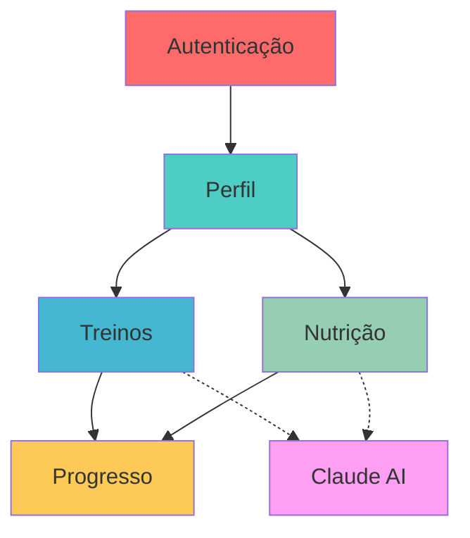

# Documentação de Negócio

Este diretório contém toda a documentação de negócio, requisitos funcionais e fluxos do projeto FitLife.

## 📋 Índice de Documentos

### Requisitos Funcionais

#### 001. [Visão Geral dos Requisitos](./001-functional-requirements-overview.md)
Documento principal com visão geral do produto, objetivos, stakeholders, escopo, arquitetura e convenções de documentação.

**Conteúdo**:
- Visão geral e propósito do FitLife
- Objetivos de negócio e técnicos
- Stakeholders primários e secundários
- Escopo completo (in/out of scope)
- Stack tecnológico e arquitetura DDD
- Modelos de dados principais (12 entidades)
- Requisitos não-funcionais
- Glossário e referências

---

#### 002. [Módulo de Autenticação](./002-auth-module-requirements.md)
Requisitos funcionais para autenticação e autorização de usuários.

**Requisitos**:
- **RF-AUTH-001**: Registro de novo usuário
- **RF-AUTH-002**: Login com email e senha
- **RF-AUTH-003**: Logout
- **RF-AUTH-004**: Refresh de token JWT
- **RF-AUTH-005**: Recuperação de senha
- **RF-AUTH-006**: Validação de email único

**Prioridade**: 🔴 Must Have (MVP)  
**Tecnologias**: JWT, bcrypt, Zod  
**Entidades**: User, RefreshToken, Email, Password

---

#### 003. [Módulo de Perfil](./003-profile-module-requirements.md)
Requisitos funcionais para gerenciamento de perfil do usuário e preferências.

**Requisitos**:
- **RF-PROFILE-001**: Criar perfil inicial
- **RF-PROFILE-002**: Atualizar dados pessoais
- **RF-PROFILE-003**: Definir objetivo fitness
- **RF-PROFILE-004**: Configurar preferências de treino
- **RF-PROFILE-005**: Configurar preferências alimentares
- **RF-PROFILE-006**: Adicionar restrições e lesões
- **RF-PROFILE-007**: Visualizar perfil completo
- **RF-PROFILE-008**: Calcular IMC automaticamente

**Prioridade**: 🔴 Must Have (MVP)  
**Entidades**: UserProfile, Weight, Height, Age, BMI  
**Enums**: Gender, FitnessGoal, ExperienceLevel, Equipment

---

#### 004. [Módulo de Treinos](./004-workout-module-requirements.md)
Requisitos funcionais para geração e acompanhamento de planos de treino.

**Requisitos**:
- **RF-WORKOUT-001**: Gerar plano de treino com IA
- **RF-WORKOUT-002**: Listar planos de treino
- **RF-WORKOUT-003**: Visualizar detalhes do plano
- **RF-WORKOUT-004**: Visualizar exercícios do plano
- **RF-WORKOUT-005**: Registrar treino executado
- **RF-WORKOUT-006**: Ver histórico de treinos
- **RF-WORKOUT-007**: Desativar/arquivar plano

**Prioridade**: 🔴 Must Have (MVP)  
**Tecnologias**: Claude AI (Haiku), BullMQ  
**Entidades**: WorkoutPlan, Exercise, WorkoutLog

---

#### 005. [Módulo de Nutrição](./005-nutrition-module-requirements.md)
Requisitos funcionais para geração e acompanhamento de planos alimentares.

**Requisitos**:
- **RF-NUTRITION-001**: Gerar plano alimentar com IA
- **RF-NUTRITION-002**: Listar planos alimentares
- **RF-NUTRITION-003**: Visualizar detalhes do plano
- **RF-NUTRITION-004**: Visualizar refeições do plano
- **RF-NUTRITION-005**: Registrar refeição consumida
- **RF-NUTRITION-006**: Ver histórico de alimentação
- **RF-NUTRITION-007**: Calcular TDEE automaticamente
- **RF-NUTRITION-008**: Desativar/arquivar plano alimentar

**Prioridade**: 🔴 Must Have (MVP)  
**Tecnologias**: Claude AI (Haiku), BullMQ  
**Entidades**: MealPlan, Meal, MealLog, TDEE  
**Cálculos**: Harris-Benedict revisada, distribuição de macros

---

#### 006. [Módulo de Progresso](./006-progress-module-requirements.md)
Requisitos funcionais para acompanhamento de evolução e estatísticas.

**Requisitos**:
- **RF-PROGRESS-001**: Registrar medidas corporais
- **RF-PROGRESS-002**: Ver evolução de peso
- **RF-PROGRESS-003**: Ver estatísticas de treinos
- **RF-PROGRESS-004**: Ver estatísticas de alimentação
- **RF-PROGRESS-005**: Exportar dados de progresso
- **RF-PROGRESS-006**: Comparar períodos (antes/depois)
- **RF-PROGRESS-007**: Dashboard de progresso
- **RF-PROGRESS-008**: Calcular IMC histórico

**Prioridade**: 🔴 Must Have (MVP)  
**Entidades**: ProgressLog, Measurements  
**Estatísticas**: Aderência, tendências, comparações

---

## 📊 Visão Geral dos Módulos

| Módulo | Requisitos | Entidades Principais | IA Integrada |
|--------|-----------|---------------------|-------------|
| Autenticação | 6 RFs | User, RefreshToken | ❌ |
| Perfil | 8 RFs | UserProfile | ❌ |
| Treinos | 7 RFs | WorkoutPlan, Exercise | ✅ |
| Nutrição | 8 RFs | MealPlan, Meal | ✅ |
| Progresso | 8 RFs | ProgressLog | ❌ |
| **Total** | **37 RFs** | **12 Entidades** | **2 Módulos** |

## 🎯 Priorização (MoSCoW)

### 🔴 Must Have (MVP)
Todos os 5 módulos são essenciais para o MVP:
1. **Autenticação**: Base de segurança
2. **Perfil**: Dados para personalização
3. **Treinos**: Core feature com IA
4. **Nutrição**: Core feature com IA
5. **Progresso**: Feedback e motivação

### 🟡 Should Have (Pós-MVP)
- Recuperação de senha (RF-AUTH-005)
- Adicionar restrições e lesões (RF-PROFILE-006)
- Calcular IMC automaticamente (RF-PROFILE-008)
- Desativar/arquivar planos (RF-WORKOUT-007, RF-NUTRITION-008)
- Exportar dados (RF-PROGRESS-005)
- Comparar períodos (RF-PROGRESS-006)
- Calcular IMC histórico (RF-PROGRESS-008)

### 🟢 Could Have (Futuro)
- Sistema de notificações
- Integração com wearables
- Rede social / feed comunitário
- Gamificação e conquistas

## 🔗 Relacionamento entre Módulos

## 📈 Estatísticas da Documentação

- **Total de Requisitos Funcionais**: 37
- **Entidades de Domínio**: 12
- **Use Cases**: ~40
- **Endpoints API**: ~35
- **Páginas de Documentação**: 450+ linhas cada
- **Cobertura**: 100% dos módulos MVP

## 🏗️ Arquitetura e Implementação

Todos os requisitos seguem **DDD (Domain-Driven Design)** e **Clean Architecture**:

### Domain Layer
- Entidades puras de negócio
- Value Objects com validações
- Interfaces de repositórios
- Regras de negócio encapsuladas

### Application Layer
- Use Cases (casos de uso)
- DTOs (Data Transfer Objects)
- Interfaces de serviços externos (IA, email, etc)

### Infrastructure Layer
- Implementações com Prisma ORM
- Controllers Fastify
- Rotas HTTP
- Integrações com Claude AI, OpenAI

Ver documentação detalhada em `.cursor/rules/backend/architecture.md`

## 📝 Convenções de ID

### Requisitos Funcionais
`RF-[MÓDULO]-[NÚMERO]`

Exemplos:
- `RF-AUTH-001`: Registro de usuário
- `RF-WORKOUT-005`: Registrar treino executado
- `RF-PROGRESS-007`: Dashboard de progresso

### Regras de Negócio
`RN-[MÓDULO]-[NÚMERO]`

Exemplos:
- `RN-AUTH-001`: Email deve ser único
- `RN-NUTRITION-004`: Distribuição de macros por objetivo

### Casos de Uso
`UC-[MÓDULO]-[NÚMERO]`

Exemplos:
- `UC-AUTH-001`: Registrar nova conta
- `UC-WORKOUT-001`: Gerar novo plano com IA

## 🔍 Como Usar Esta Documentação

### Para Desenvolvedores
1. Leia o documento [001-overview](./001-functional-requirements-overview.md) primeiro
2. Escolha o módulo a implementar (002-006)
3. Siga a ordem de requisitos listada em cada módulo
4. Use os checklists de implementação ao final de cada documento
5. Consulte `.cursor/rules/backend/` para padrões de código

### Para Product Managers
1. Use [001-overview](./001-functional-requirements-overview.md) para visão geral
2. Revise priorização MoSCoW neste README
3. Consulte requisitos específicos em cada módulo (002-006)
4. Valide critérios de aceitação com stakeholders

### Para QA/Testers
1. Critérios de aceitação estão em cada RF
2. Cenários de teste sugeridos ao final de cada RF
3. Use IDs de requisitos para rastreabilidade de bugs

## 📚 Documentação Relacionada

### Técnica
- [Setup Guide](../tech_docs/001-setup-guide.md)
- [Backend Architecture](.cursor/rules/backend/architecture.md)
- [API Standards](.cursor/rules/backend/api-standards.md)
- [Prisma Schema](../../api/prisma/schema.prisma)

### Regras de Desenvolvimento
- [Code Style](.cursor/rules/standards/code-style.md)
- [Git Workflow](.cursor/rules/standards/git-workflow.md)
- [Testing Standards](.cursor/rules/standards/testing.md)

## 📋 Próximos Passos

1. ✅ Documentação de requisitos completa (você está aqui)
2. 📝 Criar backlog de desenvolvimento no GitHub Issues
3. 🎯 Priorizar e estimar requisitos MVP
4. 🚀 Implementação por módulos:
   - Fase 1: Autenticação + Perfil
   - Fase 2: Treinos (IA)
   - Fase 3: Nutrição (IA)
   - Fase 4: Progresso
5. 🧪 Testes (unit, integration, E2E)
6. 📊 Deploy e monitoramento

## 🤝 Como Contribuir

1. Ao adicionar novo requisito, siga template dos documentos existentes
2. Numere sequencialmente dentro do módulo
3. Use kebab-case: `001-nome-descritivo.md`
4. Atualize este README com link e resumo
5. Mantenha consistência com convenções de ID

## 📞 Contato

Para dúvidas sobre requisitos, abra uma issue no GitHub ou consulte a documentação técnica em `.cursor/rules/`.
